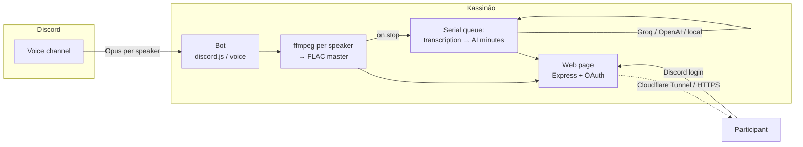

<div align="center">

# Kassinão 🎙️

### Self-hosted Discord recorder with per-speaker AI notes

Record Discord voice calls with **one separate track per person**, then get an **AI transcript** and **meeting minutes** (summary, decisions, action items) — automatically, with **perfect speaker attribution** and no AI guessing who said what.

**🌎 Language:** **English** · [Português (BR)](README.pt-BR.md)

[](LICENSE)
[](https://github.com/resolvicomai/kassinao/actions/workflows/ci.yml)
[](https://www.typescriptlang.org/)
[](https://www.docker.com/)
[](CONTRIBUTING.md)

</div>

<!-- 📹 DEMO: substitua por um GIF/vídeo real (docs/demo.gif) mostrando /gravar → painel → página com player + ata. É o ativo #1 do lançamento. -->
<p align="center"><em>▶️ Demo GIF coming here — <code>/record</code> → live panel → recording page with player, clickable timestamps and AI minutes.</em></p>

---

## Why Kassinão?

Bots like [Craig](https://craig.chat/) nail multi-track recording. AI note-takers like Otter or Fireflies nail summaries — but they **guess** who spoke (diarization), and that guessing breaks on crosstalk and non-English names.

Kassinão combines both **and sidesteps the hard part**: because every participant is captured on their **own audio track**, it already knows *exactly* who said what. The transcript and the AI minutes inherit that perfect attribution for free. It's open-source, self-hosted, and privacy-first.

## Contents

- [Features](#features)
- [Quick start](#quick-start)
- [How it compares](#how-it-compares)
- [Transcription backends](#transcription-backends)
- [Commands](#commands)
- [Configuration](#configuration)
- [Security & privacy](#security--privacy)
- [How it works](#how-it-works)
- [Contributing](#contributing)
- [License](#license)

## Features

- **🎚️ Multi-track** — one lossless FLAC track per speaker, all sample-aligned.
- **📝 AI transcription** with exact speaker names & timestamps. Engines: **Groq**, **OpenAI**, **Gemini**, or a **local** command (faster-whisper / whisper.cpp) for full privacy.
- **📋 AI meeting minutes** — summary, decisions, action items (with owner/due), timestamped topics, and a **per-participant** breakdown.
- **🔊 Recording web page** — audio player with **clickable timestamps**, downloads in **MP3 / FLAC / single mix / Audacity project**, transcript & minutes rendered inline — all behind **Discord login**.
- **🔒 Real access control** — only call participants, people who can see the channel, the initiator, or admins can open a recording. A leaked link opens nothing.
- **🎛️ Live panel** in the voice channel with **Stop** / **Add note** buttons and a `[RECORDING]` nickname indicator (visible consent).
- **🤖 Auto-record** — starts by itself when N people join a channel; stops when it empties.
- **❓ Built-in onboarding** — `/help` with interactive topic buttons; DM the bot and it replies with the guide too.
- **🌎 Bilingual** (pt-BR / English), **HTTPS via Cloudflare Tunnel** (no open ports), auto-stop, retention/expiry, crash recovery and graceful shutdown.

## Quick start

You need a machine with **Docker** and a **Discord application** ([1-minute setup](#1-create-the-discord-app)).

```bash
git clone https://github.com/resolvicomai/kassinao.git && cd kassinao
cp .env.example .env      # fill DISCORD_TOKEN, APPLICATION_ID, DISCORD_CLIENT_SECRET, BASE_URL
docker compose up -d --build
```

Then run **`/record`** in a Discord voice channel. That's it. Full walkthrough below.

> ☁️ One-click hosts: [Render blueprint](render.yaml) included.
> [](https://railway.app/new/template?template=https://github.com/resolvicomai/kassinao)
> Avoid serverless (Vercel/Netlify) — the voice gateway needs an always-on WebSocket.

### 1. Create the Discord app
1. <https://discord.com/developers/applications> → **New Application**.
2. **General Information** → copy **Application ID** → `APPLICATION_ID`.
3. **Bot** → **Reset Token** → `DISCORD_TOKEN` (no privileged intents needed).
4. **OAuth2** → copy **Client Secret** → `DISCORD_CLIENT_SECRET`; add `BASE_URL/auth/callback` under **Redirects**.
5. Invite it (replace `APP_ID`):
   `https://discord.com/oauth2/authorize?client_id=APP_ID&scope=bot%20applications.commands&permissions=68176896`

### 2. Make it reachable
- **Recommended — Cloudflare Tunnel** (HTTPS, no open ports): create a tunnel, set `TUNNEL_TOKEN`, point the public hostname to `kassinao:8080`, and set `BASE_URL=https://your-subdomain.your-domain.com`. The bundled `docker-compose.yml` runs the tunnel for you.
- **Simple — direct IP**: `BASE_URL=http://YOUR_IP:8080`, publish port 8080, and register the matching OAuth redirect.

### 3. (Optional) Turn on transcription + minutes
Both light up automatically once a Groq key is present (Groq runs the LLM too):
```env
TRANSCRIBE_PROVIDER=groq
GROQ_API_KEY=gsk_...     # https://console.groq.com  (enable Zero Data Retention!)
MINUTES_ENABLED=auto
```

## How it compares

| | **Kassinão** | Craig | Otter / Fireflies |
|---|:---:|:---:|:---:|
| Multi-track (one file per speaker) | ✅ | ✅ | ❌ |
| Perfect speaker attribution (no AI diarization) | ✅ | ✅ | ❌ (guessed) |
| AI minutes (summary, decisions, tasks) | ✅ | ❌ | ✅ |
| Per-participant breakdown | ✅ | ❌ | ⚠️ |
| Self-hosted / your data | ✅ | ⚠️ | ❌ |
| Access gated by login (not "who has the link") | ✅ | ⚠️ | ✅ |
| Open-source (MIT) | ✅ | ✅ | ❌ |
| Price | Free | Freemium | Paid |

## Transcription backends

| Provider | Cost (per audio hour) | pt-BR quality | Privacy | Notes |
|---|---|---|---|---|
| **Groq** (`whisper-large-v3-turbo`) | ~US$0.04 | Excellent | Cloud (enable ZDR) | Best value; free tier often covers small teams |
| **OpenAI** (`whisper-1`) | ~US$0.36 | Excellent | Cloud | Timestamped segments |
| **Gemini** (`gemini-2.x-flash`) | ~cents | Good | Cloud (paid tier only) | Free tier trains on your audio — avoid |
| **Local** (`faster-whisper`) | Free | Good (`small`+) | 🔒 Never leaves your server | Slower without a GPU; see [`scripts/transcribe-local.py`](scripts/transcribe-local.py) |

The AI minutes run on Groq's LLM (same key), a few cents per meeting.

## Commands

| English | pt-BR | Does |
|---|---|---|
| `/record [channel]` | `/gravar [canal]` | Start recording (your voice channel, or the given one) |
| `/stop` | `/parar` | End it and generate the link with audio, transcript and minutes |
| `/note <text>` | `/nota <texto>` | Mark a note at the current time (or the 📝 panel button) |
| `/status` | `/status` | Current recording status |
| `/recordings` | `/gravacoes` | Your latest recordings, with links (filtered by access) |
| `/help` | `/ajuda` | Interactive guide (also replies in DMs) |
| `/autorecord on/off/view` | `/autorecord ligar/desligar/ver` | Automatic recording per channel (admin) |

Anyone can record and stop. `/autorecord` requires **Manage Server**. Deleting a recording (from its page) is limited to the initiator or admins.

## Configuration

All options live in [`.env.example`](.env.example). Key ones:

| Variable | Default | Description |
|---|---|---|
| `DISCORD_TOKEN` · `APPLICATION_ID` · `DISCORD_CLIENT_SECRET` | — | Bot credentials (Developer Portal) |
| `BASE_URL` | `http://localhost:8080` | Public URL for links & OAuth |
| `TUNNEL_TOKEN` | — | Cloudflare Tunnel token (recommended HTTPS path) |
| `GUILD_ID` | — | Registers commands instantly in that server |
| `RETENTION_DAYS` · `MAX_RECORDING_HOURS` | `7` · `6` | Retention & max length |
| `TRANSCRIBE_PROVIDER` | `none` | `none` / `openai` / `groq` / `gemini` / `command` |
| `GROQ_API_KEY` / `OPENAI_API_KEY` / `GEMINI_API_KEY` | — | Key for the chosen provider |
| `MINUTES_ENABLED` | `auto` | AI minutes: `auto` (on when a Groq key exists) / `true` / `false` |
| `TZ` | `America/Sao_Paulo` | Timezone for dates (the web page uses the visitor's) |

## Security & privacy

Recording voice is processing **personal data**. Kassinão is built accordingly:

- Access is always validated by **Discord OAuth login** + participant/channel checks — never by "who has the link".
- The bot shows `[RECORDING]` in its nickname and posts a panel in the channel (visible consent).
- Run transcription **locally**, or enable **Zero Data Retention** on your cloud provider, so audio isn't retained by third parties.
- Secrets live only in `.env` (git-ignored) — **never** committed. See [SECURITY.md](SECURITY.md).

## How it works

Opus packets from each speaker are decoded to PCM and fed to **one ffmpeg per speaker** writing **continuous FLAC** (silence between speech compresses to almost nothing and keeps every track in sync). Downloads (MP3/FLAC/mix/Audacity) are cooked on demand and cached. Transcription and minutes run in a **serial queue** after the call; the web page refreshes itself until they're ready. The page authenticates with **Discord OAuth** (`identify`) and the backend re-checks with Discord who may open each recording.



**Stack:** Node.js · TypeScript · discord.js / @discordjs/voice · Express · ffmpeg · Docker · Cloudflare Tunnel.

## Contributing

PRs and issues welcome — see [CONTRIBUTING.md](CONTRIBUTING.md) and the [Code of Conduct](CODE_OF_CONDUCT.md). Run `npm run build` before opening a PR.

## License

[MIT](LICENSE) © Mauro Marques. Use, modify and share freely.

---

<div align="center">
<sub>If Kassinão is useful to you, a ⭐ helps others find it.</sub>
</div>
