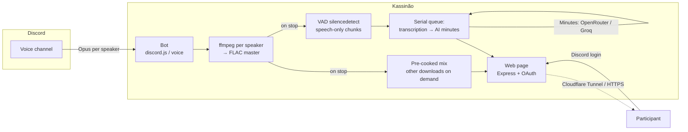

<div align="center">

# Kassinão 🎙️

### Every speaker gets their own track. No AI guesswork about who said what.

**🌎 Language:** **English** · [Português (BR)](README.pt-BR.md)

[](LICENSE)
[](CONTRIBUTING.md)
[](https://github.com/resolvicomai/kassinao/stargazers)

<br/>

[](https://kassinao.resolvicomai.app/demo)

A real recording page from a fictional 6-person, 1-hour meeting — transcript colored by speaker, AI-generated minutes, and player. No login needed.

<sub>Prefer plain text? Read the same transcript &amp; minutes in [`docs/example/`](docs/example/).</sub>

</div>

---

Every AI notetaker guesses who's talking from voice patterns alone — and the guess falls apart the moment two people overlap or a name isn't English. Kassinão doesn't guess: each person in the call records to their own audio track, so the transcript, the meeting summary, and `/ask` always know, with certainty, who said what.

## Contents

- [Knows who's talking](#knows-whos-talking)
- [Becomes memory that answers](#becomes-memory-that-answers)
- [Yours, with real control](#yours-with-real-control)
- [Quick start](#quick-start)
- [How it compares](#how-it-compares)
- [Reference](#reference)
- [How it works](#how-it-works)

## Knows who's talking

- One separate audio track per speaker — attribution comes from how the call was recorded, not from a voice-pattern guess.
- Automatic transcription with the right name on every line, via AssemblyAI, Groq, OpenAI, Gemini, or a fully local engine.
- Real voice activity detection: only speech gets sent to the transcription API, so silence costs nothing and invents nothing.
- Accents, crosstalk, and non-English names don't confuse it — there's no diarization step to confuse.
- Automatic retry and resume if a provider rate-limits mid-transcription.

## Becomes memory that answers

- AI-generated meeting minutes: summary, decisions, and action items, each with an owner and a due date.
- `/ask` right inside Discord — ask a question in plain language, get an answer with clickable `[hh:mm:ss]` citations.
- A web index with full-text search across every transcript, minutes doc, and note you're allowed to see.
- An optional MCP connector plugs that same memory into Claude Desktop, Cursor, or any MCP-capable assistant.
- Minutes get posted straight to a Discord channel the moment they're ready — no login required to read that summary.

## Yours, with real control

- Self-hosted: it runs on your own Docker, and your recordings never touch a third-party SaaS.
- Access requires current Discord-server membership. Private calls stay limited to their participants, starter, and current admins — a leaked link opens nothing for a stranger.
- Retention is a dial, not a default: expire audio on a schedule, keep the searchable text longer, or turn expiry off entirely.
- Open source under AGPL-3.0-or-later — read it, fork it, self-host a modified version; just pass the source along too.
- Runs behind HTTPS with no open inbound ports, via the bundled Cloudflare Tunnel profile.

## Quick start

You need a machine with **Docker** and a **Discord application** (free, 1-minute setup below).

> **Create the Discord app first** — the bot won't boot without `DISCORD_TOKEN`.

```bash
git clone https://github.com/resolvicomai/kassinao.git && cd kassinao
cp .env.example .env      # fill DISCORD_TOKEN, APPLICATION_ID, DISCORD_CLIENT_SECRET, BASE_URL
                          # tip: set GUILD_ID too, so slash commands show up instantly
docker compose up -d --build
```

Then **invite the bot** (step 1 below) and run **`/record`** in a Discord voice channel. That's the whole loop.

> ☁️ **One-click deploy:** [](https://render.com/deploy?repo=https://github.com/resolvicomai/kassinao) — blueprint in [`render.yaml`](render.yaml). Set `GROQ_API_KEY` + `TRANSCRIBE_PROVIDER=groq` in the dashboard to turn on transcription and minutes.
> Avoid serverless platforms (Vercel/Netlify) — the voice gateway needs an always-on WebSocket.

### 1. Create the Discord app

1. <https://discord.com/developers/applications> → **New Application**.
2. **General Information** → copy **Application ID** → `APPLICATION_ID`.
3. **Bot** → **Reset Token** → `DISCORD_TOKEN` (no privileged intents needed).
4. **OAuth2** → copy **Client Secret** → `DISCORD_CLIENT_SECRET`; add `BASE_URL/auth/callback` under **Redirects**.
5. Invite it (replace `APP_ID`):
   `https://discord.com/oauth2/authorize?client_id=APP_ID&scope=bot%20applications.commands&permissions=68242432`
   Permissions: View Channels, Send Messages, Embed Links, Read Message History, Connect, Change Nickname.

### 2. Make it reachable

- **Recommended — Cloudflare Tunnel** (HTTPS, no open ports): create a tunnel, then in `.env` set `TUNNEL_TOKEN` **and** `COMPOSE_PROFILES=tunnel`, point the public hostname to `kassinao:8080`, set `BASE_URL=https://your-subdomain.your-domain.com`, and re-run `docker compose up -d`. The bundled tunnel service only starts under the `tunnel` profile, so it never crash-loops when you're not using it.
- **Direct IP (dev/test only — no HTTPS)**: uncomment `ports: ['8080:8080']` in `docker-compose.yml` and set `BASE_URL=http://YOUR_IP:8080`. Discord OAuth only accepts `https` (or `localhost`) redirects, so the login/download page won't work over a plain IP — use the tunnel (or any HTTPS proxy) for real use.

### 3. (Optional) Turn on transcription + minutes

Best quality for the money (AssemblyAI for speech, any big-context model via OpenRouter for the minutes):

```env
TRANSCRIBE_PROVIDER=assemblyai
ASSEMBLYAI_API_KEY=...     # https://www.assemblyai.com — US$50 free credit
GROQ_API_KEY=gsk_...       # optional fallback engine (https://console.groq.com)
OPENROUTER_API_KEY=sk-or-...  # https://openrouter.ai — minutes LLM (default: google/gemini-2.5-flash)
MINUTES_ENABLED=auto
```

OpenRouter is a paid LLM gateway (one key, many models, its own credits) — the minutes cost roughly a few cents per meeting.
Zero-cost path: `TRANSCRIBE_PROVIDER=groq` with just a `GROQ_API_KEY` (free tier: 8 audio-hours/day; minutes then run on Groq's free LLM in map-reduce for long calls).

## How it compares

Craig records. Otter summarizes. Kassinão knows who's talking.

|                                                  |     **Kassinão**     |  Craig   | Otter / Fireflies |
| ------------------------------------------------ | :------------------: | :------: | :---------------: |
| Multi-track (one file per speaker)               |          ✅          |    ✅    |        ❌         |
| Perfect speaker attribution (no AI diarization)  |          ✅          |    ✅    |   ❌ (guessed)    |
| AI minutes (summary, decisions, tasks)           |          ✅          |    ❌    |        ✅         |
| Per-participant breakdown                        |          ✅          |    ❌    |        ⚠️         |
| Self-hosted / your data                          |          ✅          |    ⚠️    |        ❌         |
| Access gated by login (not "who has the link")   |          ✅          |    ⚠️    |        ✅         |
| Open-source (AGPL-3.0)                           |          ✅          |    ✅    |        ❌         |
| Price                                            |         Free         | Freemium |       Paid        |

## Reference

Day-two material for people who already decided to run it — not required reading before you try the demo.

### Configuration

All options live in [`.env.example`](.env.example). Key ones:

| Variable | Default | Description |
|---|---|---|
| `DISCORD_TOKEN` · `APPLICATION_ID` · `DISCORD_CLIENT_SECRET` | — | Bot credentials (Developer Portal) |
| `BASE_URL` | `http://localhost:8080` | Public URL for links and OAuth |
| `GUILD_ID` | — | Registers commands instantly in that server |
| `TUNNEL_TOKEN` / `COMPOSE_PROFILES` | — | Cloudflare Tunnel token + the `tunnel` profile (recommended HTTPS path) |
| `REPO_PUBLIC` | `false` | `true` shows the GitHub/source links and the "auditable" claim on the landing page |
| `RETENTION_DAYS` · `MAX_RECORDING_HOURS` | `7` · `6` | Audio retention and max recording length (`0` retention = unlimited: nothing expires, manual delete only) |
| `TEXT_RETENTION_DAYS` | `90` | How long transcript/minutes/notes outlive the audio (never below `RETENTION_DAYS`; `0` = forever) |
| `TRANSCRIBE_PROVIDER` | `none` | `none` / `assemblyai` / `openai` / `groq` / `gemini` / `command` |
| `ASSEMBLYAI_API_KEY` / `GROQ_API_KEY` / `OPENAI_API_KEY` / `GEMINI_API_KEY` | — | Key for the chosen provider (a Groq key also doubles as the ASR fallback) |
| `TRANSCRIBE_PROMPT` / `TRANSCRIBE_KEYTERMS` | — | Domain vocabulary for the ASR engine (Whisper prompt / AssemblyAI keyterms); participant names are injected automatically |
| `MINUTES_ENABLED` | `auto` | AI minutes: `auto` (on when an OpenRouter or Groq key exists) / `true` / `false` |
| `MINUTES_PROVIDER` / `OPENROUTER_API_KEY` | `openrouter` when key set | Minutes LLM: `openrouter` (default `google/gemini-2.5-flash`) or `groq` (default `llama-3.3-70b-versatile`) |
| `MINUTES_WEBHOOK_URL` | — | POSTs a JSON `minutes.ready` event per meeting to your own integration; env-only by design (no SSRF via Discord) |
| `MCP_SECRET` | — | Turns the MCP connector on; rotating it revokes every connector at once |
| `OWNER_IDS` | — | Discord IDs allowed to use `/mcp` (CSV); regular members self-serve at `/app/conectar-ia` |
| `DEFAULT_LOCALE` | `en` | Language for DMs/replies when no per-user locale is available (guild members still see their own Discord client's language) |
| `TZ` | `America/Sao_Paulo` | Timezone for dates (the web page defaults to the visitor's own) |

More knobs — disk guard, disk-full alerts, off-site backup via rclone — are all documented one option at a time in [`.env.example`](.env.example).

### Commands

| Command | Does |
|---|---|
| `/record [channel]` | Start recording (your voice channel, or the one given) |
| `/stop` | End it and generate the link with audio, transcript, and minutes |
| `/note <text>` | Mark a note at the current time (or the 📝 panel button) |
| `/status` | Current recording status |
| `/recordings` | Your latest recordings, filtered by access — also links to the web index with full-text search |
| `/ask <question> [days]` | Ask your meetings a question — AI answers (only you see it), with timestamped citations, from transcripts you can access |
| `/config minutes-channel` / `/config view` | Admin: pick the text channel where the minutes summary gets posted (default: the voice channel's own chat) |
| `/autorecord on/off/view` | Automatic recording per channel (admin) |
| `/mcp new` / `/mcp revoke-all` | Owner-only (`OWNER_IDS`): generate or revoke an AI-connector code — regular members self-serve at `/app/conectar-ia` on the web |
| `/help` | Interactive onboarding guide (also replies in DMs) |
| `/about` | Author, license, and source code |

Any member can start a recording in the channel they are currently in; people with **Manage Server** may also target another channel they can see. Stopping and annotating require continued access to the recorded channel; `/autorecord` and `/config` require **Manage Server**. `/mcp` only exists when the connector is on (`MCP_SECRET` set). Deleting a recording (from its page) is limited to the initiator or admins.

The MCP connector applies the exact same access check as the web page, meeting by meeting: current members see only what they'd already see on the site. Private-channel history never opens retroactively just because someone gained channel access later. Read-only, no audio, revocable at any time. Client setup and full docs: [`mcp/`](mcp/).

### Transcription backends

| Provider | Cost (per audio hour, **per track**) | pt-BR quality | Privacy | Notes |
|---|---|---|---|---|
| **AssemblyAI** (`universal-3-5-pro`) | ~US$0.21 (**US$50 free credit**) | Top-3 on the Open ASR Leaderboard | Cloud | Default pick; auto-falls back to Groq if a `GROQ_API_KEY` is set |
| **Groq** (`whisper-large-v3`) | ~US$0.11 (free tier: 8 audio-h/day) | Excellent | Cloud (enable ZDR) | Best zero-cost option |
| **OpenAI** (`whisper-1`) | ~US$0.36 | Excellent | Cloud | Timestamped segments |
| **Gemini** (`gemini-2.0-flash`, default) | ~cents | Good | Cloud (paid tier only) | Free tier trains on your audio — avoid |
| **Local** (`faster-whisper`) | Free | Good (`small`+) | 🔒 Never leaves your server | Slower without a GPU; see [`scripts/transcribe-local.py`](scripts/transcribe-local.py) |

Recording is multi-track, but only **speech** is sent (VAD trims the silence-padded tracks), so a 1-hour call costs roughly the total spoken time — not hours × speakers. AI minutes run once per meeting (OpenRouter or Groq), a few cents each at most.

## How it works

Opus packets from each speaker are decoded to PCM and fed to **one ffmpeg per speaker** writing **continuous FLAC** (silence between speech compresses to almost nothing and keeps every track in sync). When the recording stops, the single **mix is pre-cooked** right away so the player starts instantly; the other downloads (MP3/FLAC/Audacity) are still cooked on demand and cached. Transcription and minutes run in a **serial queue** after the call: **VAD** (ffmpeg `silencedetect`) trims each track so **only speech segments** are sent to the ASR provider (**AssemblyAI** — with Groq fallback —, **Groq**, **OpenAI**, **Gemini**, or a **local** command), then the minutes LLM runs via **OpenRouter** or **Groq**; the web page refreshes itself until they're ready. The page authenticates with **Discord OAuth** (`identify`) and the backend re-checks with Discord who may open each recording.



**Stack:** Node.js · TypeScript · discord.js / @discordjs/voice · Express · ffmpeg · Docker · Cloudflare Tunnel.

## Security & privacy

Recording voice is processing personal data, so access control isn't a feature bullet here — it's the thing to actually verify:

- Every page request is authenticated via Discord OAuth and requires current membership in the recording's server. Private calls are restricted to their starter/participants and current admins; only a channel that was public to `@everyone` when recording began may also follow its current `View Channel` audience. Destructive actions bypass the short membership cache and re-check Discord via REST. The full policy is one file: [`src/web/access.ts`](src/web/access.ts).
- Nothing leaves your server for transcription unless you configure a cloud provider — and even then, only the VAD-trimmed speech segments go out, never full raw audio you didn't intend to transcribe.
- Prefer zero retention on the wire: turn on your provider's Zero Data Retention option (Groq offers one), or skip the cloud path entirely with the local `command` transcription backend.
- Secrets (`DISCORD_TOKEN`, `MCP_SECRET`, API keys) live only in your own `.env`, which ships git-ignored — never committed, never sent anywhere by the bot itself.
- Found an actual vulnerability? See [SECURITY.md](SECURITY.md) for how to report it privately.

## Contributing

PRs and issues welcome — see [CONTRIBUTING.md](CONTRIBUTING.md) and the [Code of Conduct](CODE_OF_CONDUCT.md). Run `npm run build` before opening a PR.

## License

[GNU AGPL-3.0-or-later](LICENSE) © 2026 Mauro Marques (resolvicomai).

Free and open source. You may use, study, modify and share it — but if you run a
modified version as a network service (e.g. host the bot for others), the AGPL
requires you to offer those users the corresponding source code. The bot's
`/about` (`/sobre`) command links to this repository to satisfy that.

Uses [ffmpeg](https://ffmpeg.org/) (via `ffmpeg-static`, GPL/LGPL) as a separate
external binary; its own license applies to that binary.

---

<div align="center">
<sub>If Kassinão is useful to you, a ⭐ helps others find it.</sub>
</div>
