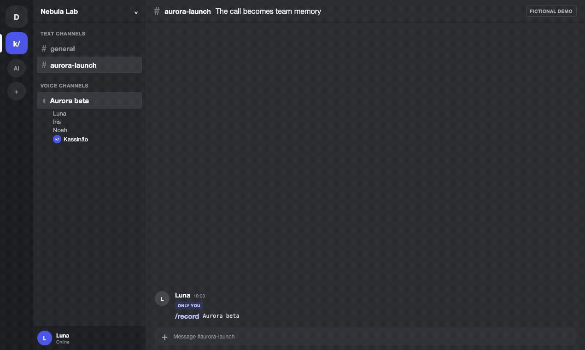

# Kassinão

**A self-hosted Discord bot that records calls and can turn them into searchable meeting memory.**

[Português (BR)](README.pt-BR.md) · [Documentation](https://docs.kassinao.cloud/en) · [Public demo](https://kassinao.cloud/demo?lang=en) · [MCP connector](mcp/README.md)

[](LICENSE)
[](https://github.com/resolvicomai/kassinao/actions/workflows/ci.yml)

<a href="https://kassinao.cloud/demo?lang=en"></a>

<sub>Fictional demo rendered by the product interface. AI features are enabled for the example; a new installation starts with them off.</sub>

Kassinão joins an authorized Discord voice channel, publishes a visible recording panel before capture starts, and keeps a separate audio track for each Discord account that speaks. It also produces a mixed file and supports timestamped notes. After the call, authorized people can use the private web app to play or download the result.

Transcription, AI minutes, `/ask`, webhooks, and MCP are separate operator-controlled opt-ins. Kassinão does not provide a shared hosted workspace, public signup, or a central meeting archive.

Kassinão is an independent project and is not affiliated with or endorsed by Discord.

## What is included

**Base recording, without an AI provider**

- one track per Discord account that speaks, plus a mixed recording;
- presence, meeting metadata, and timestamped notes;
- a recording panel in the voice channel's chat before capture begins;
- a private meeting page with playback and downloads after recording stops;
- retention and per-meeting access controls.

**Optional capabilities**

- speech-to-text through a configured ASR provider or an operator-built local image;
- AI minutes, decisions, and action items after a transcript exists;
- `/ask` over authorized meetings, with links to supporting sources;
- signed HTTPS minutes webhooks;
- five read-only MCP tools exposed by the instance.

Speech is associated with a Discord account/stream, not identified from a mixed recording through later diarization. This preserves the platform attribution, but it does not prove a person's real-world identity or guarantee that a partial/failed track is complete.

## The real flow

1. A member runs `/record` (`/gravar` in pt-BR) in a voice channel.
2. The bot checks the guild, channel, user, and required permissions.
3. It attempts to add a recording indicator to its nickname, then publishes the recording panel. The nickname is best effort; the panel is required.
4. Each account that speaks gets its own track. Members can add timestamped notes while the call is active.
5. `/stop` closes the recording and makes the audio available.
6. If the operator enabled ASR and minutes, those jobs run asynchronously. Processing time depends on call length, queue, provider, retries, and rate limits; there is no fixed SLA.
7. The channel receives only a generic completion notice. Authorized users open details in the private app or through an authorized DM link.

The panel is a technical disclosure, not proof of consent. The operator is responsible for the notices, permissions, legal basis, and organizational rules required where the bot is used, especially before enabling auto-record.

## Public project, private instance

| Public project material | Private operator material |
| --- | --- |
| AGPL source, generic docs, Dockerfile, workflows, templates, and fictional demo | Discord/provider credentials, guild and owner IDs, domains, tunnel routes, recordings, auth state, MCP tokens, backups, retention choices, and operational runbooks |

Every operator creates a separate Discord application and chooses their own URLs and storage. A new deployment must not reuse another instance's `.env`, auth volume, Discord application, OAuth callback, tunnel token, or MCP configuration.

The AGPL applies to the software. If an operator modifies the program and lets users interact with it over a network, AGPL section 13 generally requires offering those users the Corresponding Source for the running version. Runtime configuration, secrets, recordings, and organization data remain private; product code changes cannot be hidden by calling them configuration. Set `SOURCE_URL` to the source actually offered for the running version. This is a practical summary, not legal advice; [the license controls](LICENSE).

## Source quickstart

This path is for local evaluation and development. It builds the image from the checked-out source; it is not the hardened production path.

Requirements: Docker with Compose, and a Discord application owned by you.

```bash
git clone https://github.com/resolvicomai/kassinao.git
cd kassinao
cp .env.example .env
chmod 600 .env
mkdir -p data/{recordings,state,auth,cache}
chmod 700 data data/*
```

Set at least these values in `.env`:

```env
DISCORD_TOKEN=your_bot_token
APPLICATION_ID=your_application_id
DISCORD_CLIENT_SECRET=your_oauth_client_secret
APP_URL=http://localhost:8080
ALLOW_LOCAL_APP_URL=true
OPERATOR_NAME="Local Kassinão operator"
PRIVACY_POLICY_URL="http://localhost:8080/privacy"
OPERATOR_CONTACT_URL="http://localhost:8080/privacy#contact"
DATA_DELETION_URL="http://localhost:8080/privacy#data-rights"
PRIVACY_EFFECTIVE_DATE=2026-07-14
PRIVACY_POLICY_VERSION=local-1
PRIVACY_AUDIENCE="Operator using fictional test data on localhost"
PRIVACY_PURPOSES="Local evaluation without real meeting data"
PRIVACY_LAWFUL_BASIS="Local evaluation with fictional data only"
INFRASTRUCTURE_PROVIDER="Local machine"
INFRASTRUCTURE_REGION="Local device"
EDGE_PROVIDER=none
EDGE_REGION=none
OPERATIONAL_LOG_RETENTION="Until this local test is removed"
BACKUP_STATUS=disabled
BACKUP_PROVIDER=none
BACKUP_REGION=none
BACKUP_RETENTION_DAYS=0
DATA_REQUEST_PROCESS="Remove the fictional test data from this local machine"
DATA_REQUEST_RESPONSE_DAYS=30
INCIDENT_CONTACT_URL="http://localhost:8080/privacy#contact"
INCIDENT_PROCESS="Stop the local instance and remove test credentials and data"
SOURCE_URL=https://github.com/resolvicomai/kassinao
ALLOWED_GUILD_IDS=your_test_guild_id
ALLOW_ALL_GUILDS=false
KASSINAO_IMAGE=kassinao-local:dev
KASSINAO_PULL_POLICY=never
```

Then build locally before starting Compose:

```bash
docker build -t kassinao-local:dev .
docker compose up -d --no-build
docker compose logs -f kassinao
```

For a public deployment, use your own HTTPS origins and keep `ALLOW_LOCAL_APP_URL=false`.

## Discord application setup

Create a new application in the [Discord Developer Portal](https://discord.com/developers/applications). Each instance needs its own application.

1. Copy the **Application ID**, create the bot token, and copy the OAuth **Client Secret**.
2. For a private company instance, turn **Public Bot** off (`bot_public=false`). This prevents people other than the application owner from adding it to guilds; the runtime allowlist remains mandatory.
3. Under **Installation**, use **Guild Install** with scopes `bot` and `applications.commands`.
4. Request permissions bitfield `68242432`: View Channel, Send Messages, Embed Links, Read Message History, Connect, and Change Nickname. Change Nickname is recommended; the other five are required in the recording channel.
5. Under **OAuth2 → Redirects**, register exactly `${APP_URL}/auth/callback`.
6. Under **General Information → Privacy Policy URL**, register `${APP_URL}/privacy`. The page must be publicly reachable and describe this operator's real deployment.
7. The web login requests only OAuth scope `identify`. Membership in an allowed guild is checked separately with the bot.

Install URL template:

```text
https://discord.com/oauth2/authorize?client_id=YOUR_APPLICATION_ID&scope=bot%20applications.commands&permissions=68242432
```

The bot does not request privileged Gateway intents. It does inspect the minimum necessary DM content to detect an attempted slash command and return onboarding help.

## Access model

An instance URL is public information, not a security boundary. Web and MCP access require:

- Discord login;
- current membership in an allowlisted guild; and
- the meeting ACL: starter, someone recorded/present in that call, or a current member with Manage Server.

Leaving the guild removes access. Receiving channel permission later does not unlock old meetings. If Discord cannot reliably confirm membership, access fails closed or returns temporary unavailability instead of granting access. `OWNER_IDS` does not bypass meeting access.

## Production deployment

The repository contains a release workflow and operations-bundle tooling designed for a source-free, split production deployment. Their presence in a branch is not evidence that a release, GHCR image, bundle, checksum, or attestation is public.

Only use the hardened path after the selected release is publicly verifiable:

- the GitHub release and its operations-bundle assets exist and are immutable;
- the exact OCI image resolves by `sha256` digest in GHCR;
- checksum, source/tag policy, release integrity, and GitHub attestations verify;
- a clean install from that public bundle has passed the release checks.

If any artifact is missing, build from source for local evaluation and wait for a verified release. Do not replace the missing digest with a moving tag and do not build the product on the production VPS.

The intended hardened topology is **split-only**:

- the standard host path targets a dedicated Linux VPS with systemd 249+, Docker Engine and Compose v2, iptables/ip6tables, util-linux, curl, Python 3, and dm-crypt/LUKS storage;
- landing/docs/demo run in a secret-free public process;
- bot/private app/MCP run in the private core with their own hosts and allowlists;
- the standard bundle requires a VPS dedicated to Kassinão. Its `ExecStartPre` controls apply to the entire `docker.service`, and the audit rejects unrelated containers. The operator must explicitly set `KASSINAO_DEDICATED_DOCKER_HOST_ACK=I_UNDERSTAND_THIS_VPS_MUST_RUN_ONLY_KASSINAO` before installing them;
- the VPS holds only a verified root-owned operations bundle, private environment files, and data volumes — no Git checkout, compiler, or GitHub credential;
- the release image is pinned by digest;
- active data, auth, cache, swap, and deployment snapshots live on storage verified as encrypted at rest; the standard operations bundle proves this with dm-crypt/LUKS and refuses to start when it cannot;
- after the operator mounts and secures the configured data root as mode `0700` `root:root`, `prepare-storage.sh` proves dm-crypt/LUKS before creating only the four runtime directories as mode `0700` under the configured non-root UID/GID;
- a successful deploy deletes its rollback snapshot immediately. A failed deploy may retain operational state and recording metadata, but not auth or audio tracks, for the configured `KASSINAO_ROLLBACK_RETENTION_HOURS` window (72 hours by default, 168 maximum), enforced by a persistent host timer;
- host firewall, SSH, egress, file modes, backup, and external host checks must pass before the instance is published.

The four DNS names, certificates, and tunnel/proxy routes must already resolve before `deploy-release.sh`, because its final gate tests every surface over external HTTPS. Keep the bot uninvited and the instance unannounced until deploy and audit both pass.

Inside the Compose tunnel, route `APP_URL` and `MCP_URL` to `http://kassinao:8080`, and `PUBLIC_URL` and `DOCS_URL` to `http://kassinao-public:8081`. A host proxy uses the corresponding loopback ports from `KASSINAO_HOST_PORT` and `KASSINAO_PUBLIC_HOST_PORT`. Never expose either port directly to the internet.

Detailed production and safe host-control removal procedures live in the [documentation](https://docs.kassinao.cloud/en). The uninstall refuses running/restarting containers and pending snapshots, never stops containers, never restarts Docker, and never deletes `KASSINAO_DATA_ROOT`. Keep operational evidence and organization-specific policy in the instance's private runbook, not in this repository.

## Privacy and data flow

A fresh installation defaults to audio recording with external AI egress disabled:

- `TRANSCRIBE_PROVIDER=none`
- `TRANSCRIBE_FALLBACK_PROVIDER=none`
- `MINUTES_ENABLED=false`
- MCP off until `MCP_SECRET` is set
- audio retention: 7 days
- text/metadata retention: 90 days

Enabling cloud ASR, AI minutes, a webhook, remote backup, or MCP sends the data necessary for that feature to the destination configured by the operator. “Self-hosted” does not mean data can never leave the server.

[`PRIVACY.md`](PRIVACY.md) explains what the public project does and provides an operator checklist. It is not a substitute for the deployment's policy. Production requires the operator to publish accurate identity/contact, privacy, and data-deletion information and expose it at `APP_URL/privacy`.

Security controls and operator responsibilities are documented in [`SECURITY.md`](SECURITY.md). Never place credentials, private URLs, identifiers, logs with meeting content, recordings, `.env`, auth state, or data requests in a public issue.

## MCP connector

When enabled by the operator, [`kassinao-mcp`](mcp/README.md) runs locally as a stdio client and requests authorized meeting data from that instance over HTTPS. It requires its own `KASSINAO_URL`; there is no shared hosted API and no upstream fallback. The five tools in this version are read-only, do not serve audio, and are subject to the same current-membership and meeting ACL checks as the web app.

## Commands

Commands use pt-BR names by default and English localizations in Discord.

| pt-BR | English | Availability |
| --- | --- | --- |
| `/gravar`, `/parar`, `/nota`, `/status` | `/record`, `/stop`, `/note`, `/status` | Base recording |
| `/gravacoes`, `/ajuda`, `/sobre` | `/recordings`, `/help`, `/about` | Base app/help |
| `/privacidade` | `/privacy` | Base instance policy and operator contact |
| `/autorecord`, `/config` | same names/localized options | Manage Server where required |
| `/perguntar` | `/ask` | Only when the minutes/LLM capability is enabled |
| `/mcp` | `/mcp` | Only when MCP is enabled; hidden behind Manage Server and enforced by `OWNER_IDS` |

Members create and revoke their own MCP connections in the private app when that capability is enabled.

## Development

Node.js 22+ is required.

```bash
npm ci --userconfig .npmrc.security
cp .env.example .env
npm run dev
```

Before a pull request:

```bash
npm run lint
npm run build
npm run typecheck:preview
npm test
npm run format:check
```

See [`CONTRIBUTING.md`](CONTRIBUTING.md), [`SECURITY.md`](SECURITY.md), and the [research snapshot behind the product claims](docs/research/2026-07-14-product-truth.md).

## License and costs

Kassinão is licensed under [AGPL-3.0-or-later](LICENSE). The software has no license fee, but every operator pays for and is responsible for their own infrastructure, storage, domain, backups, and any external providers they enable.
