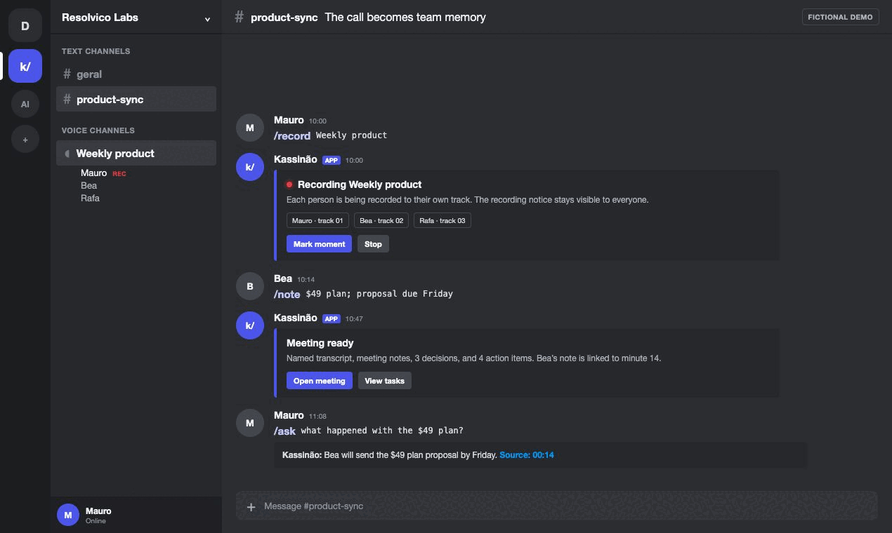
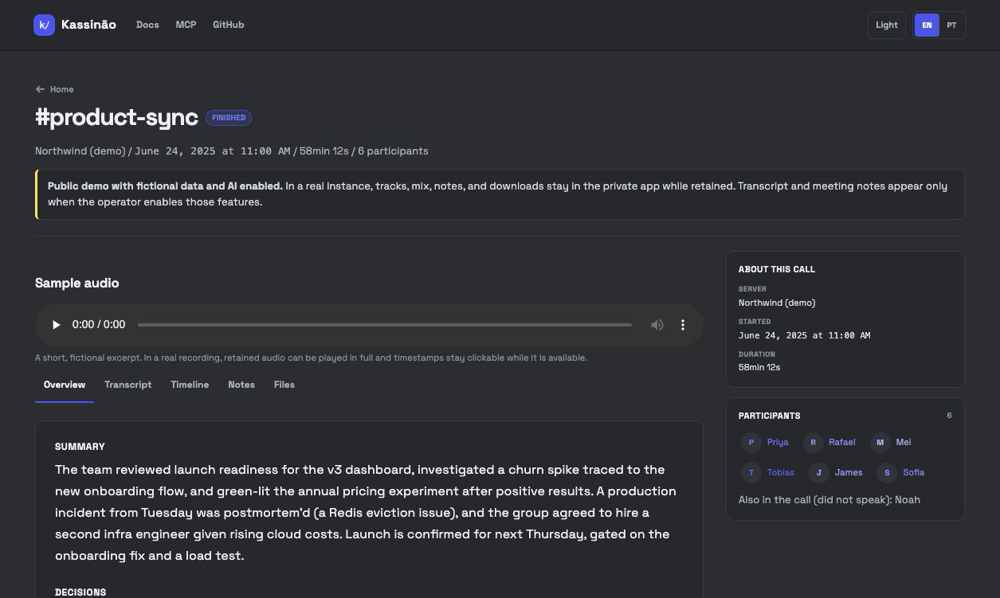
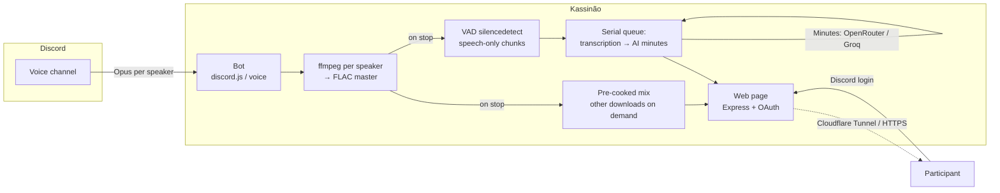

<div align="center">


# Kassinão

### Turn Discord calls into searchable memory.

Open-source, self-hosted Discord bot with one track per speaker, named transcripts, meeting notes, tasks, and sourced answers.

**🌎 Language:** **English** · [Português (BR)](README.pt-BR.md)

[](LICENSE)
[](CONTRIBUTING.md)
[](https://github.com/resolvicomai/kassinao/stargazers)

<br/>

[](https://kassinao.cloud/en/demo)
[](https://docs.kassinao.cloud/en)
[](https://mcp.kassinao.cloud)

<br/>

<a href="https://kassinao.cloud/en/demo"></a>

<sub>Fictional demo, real commands and product behavior. Meeting data is never taken from a real workspace.</sub>

</div>

---

The official hosted surfaces use one domain per responsibility:

| Surface | Official URL | Purpose |
|---|---|---|
| Website and demo | [kassinao.cloud](https://kassinao.cloud/en) | Public product story and fictional demo |
| Documentation | [docs.kassinao.cloud](https://docs.kassinao.cloud/en) | Setup, commands, security and MCP guides |
| Private app | [app.kassinao.cloud](https://app.kassinao.cloud/app) | Discord OAuth, recordings, transcripts and downloads |
| MCP API | [mcp.kassinao.cloud](https://mcp.kassinao.cloud) | Official API origin used by `kassinao-mcp`; the root links to its docs |

Self-hosted instances do not need four domains: set `BASE_URL` once and every surface inherits it. The optional split-domain variables are documented in [`.env.example`](.env.example).

Most meeting bots start from one mixed recording and use diarization to infer who spoke. Kassinão receives a separate Discord audio stream for each person, so speaker attribution comes from the account that produced the track, not a voice-pattern guess.

## Contents

- [Knows who's talking](#knows-whos-talking)
- [Becomes memory that answers](#becomes-memory-that-answers)
- [See the finished meeting](#see-the-finished-meeting)
- [Yours, with real control](#yours-with-real-control)
- [Quick start](#quick-start)
- [How it compares](#how-it-compares)
- [Reference](#reference)
- [How it works](#how-it-works)

## Knows who's talking

- One separate audio track per speaker — attribution comes from how the call was recorded, not from a voice-pattern guess.
- Automatic transcription with the right name on every line, via AssemblyAI, Groq, OpenAI, Gemini, or a fully local engine.
- Voice activity detection normally sends only detected speech. If detection fails, Kassinão uses fixed chunks instead of discarding the call.
- Crosstalk does not make Kassinão swap speaker identities because there is no diarization step assigning names to a mixed track.
- Automatic retry and resume if a provider rate-limits mid-transcription.

## Becomes memory that answers

- AI-generated meeting minutes: summary, decisions, and action items, with owners and due dates when the transcript supports them.
- `/ask` right inside Discord — ask by topic, person, meeting date, or action deadline (for example, “Ana's actions due today”). The model selects relevant source IDs; the bot itself renders the real minutes/transcript evidence with authorized links. `days` is the fallback meeting window when the question has no period.
- A web index with full-text search across every transcript, minutes doc, and note you're allowed to see.
- An optional MCP connector plugs that same memory into Claude Desktop, Cursor, or any MCP-capable assistant.
- The Discord channel receives only a generic completion notice; authorized participants receive the private link and minutes by DM.

## See the finished meeting

[](https://kassinao.cloud/en/demo)

The public demo uses fictional meeting data and the same renderer as a real recording page. Interface language can change; the original meeting content is never silently translated.

## Yours, with real control

- Self-hosted: the bot and files run on your Docker. If you configure an external transcription or minutes provider, the required audio or text is sent to that provider; local processing keeps it on your server.
- Access requires current Discord-server membership. Private calls stay limited to their participants, starter, and current admins — a leaked link opens nothing for a stranger.
- Retention is a dial, not a default: expire audio on a schedule, keep the searchable text longer, or turn expiry off entirely.
- Open source under AGPL-3.0-or-later — read it, fork it, self-host a modified version; just pass the source along too.
- Runs behind HTTPS with no open inbound ports, via the bundled Cloudflare Tunnel profile.

## Quick start

You need a machine with **Docker** and a **Discord application** (free, 1-minute setup below).

> **Create the Discord app first** — the bot won't boot without `DISCORD_TOKEN`.

```bash
git clone https://github.com/resolvicomai/kassinao.git && cd kassinao
cp .env.example .env && chmod 600 .env
mkdir -p recordings && chmod 700 recordings
# Fill DISCORD_TOKEN, APPLICATION_ID, DISCORD_CLIENT_SECRET and BASE_URL.
# Tip: set GUILD_ID too, so slash commands show up instantly.
docker compose up -d --build
```

Keep `.env` owned by the deployment user and at mode `0600`. `./scripts/inject-secrets.sh` accepts the three setup secrets without echoing them on screen; never paste populated values into issues, chat, shell commands or logs. The container runs without root as UID/GID `1000` by default. If an existing `recordings/` belongs to root, run `sudo chown -R 1000:1000 recordings`; custom non-root IDs can be set with `KASSINAO_UID` and `KASSINAO_GID`.

For a self-hosted Linux server, install the host-side health watchdog after the first deploy. It can restart only the `kassinao` container and replaces socket-mounted autoheal containers:

```bash
sudo install -o root -g root -m 0755 scripts/health-watch.sh /usr/local/sbin/kassinao-health-watch
sudo install -o root -g root -m 0644 deploy/systemd/kassinao-health-watch.* /etc/systemd/system/
sudo systemctl daemon-reload
sudo systemctl enable --now kassinao-health-watch.timer
```

Then **invite the bot** (step 1 below) and run **`/record`** in a Discord voice channel. That's the whole loop.

> ☁️ **One-click deploy:** [](https://render.com/deploy?repo=https://github.com/resolvicomai/kassinao) — blueprint in [`render.yaml`](render.yaml). Set `GROQ_API_KEY` + `TRANSCRIBE_PROVIDER=groq` in the dashboard to turn on transcription and minutes.
> Avoid serverless platforms (Vercel/Netlify) — the voice gateway needs an always-on WebSocket.

### 1. Create the Discord app

1. <https://discord.com/developers/applications> → **New Application**.
2. **General Information** → copy **Application ID** → `APPLICATION_ID`.
3. **Bot** → **Reset Token** → `DISCORD_TOKEN` (no privileged intents needed).
4. **OAuth2** → copy **Client Secret** → `DISCORD_CLIENT_SECRET`; add `APP_URL/auth/callback` under **Redirects** (`BASE_URL/auth/callback` when `APP_URL` is not set).
5. Invite it (replace `APP_ID`):
   `https://discord.com/oauth2/authorize?client_id=APP_ID&scope=bot%20applications.commands&permissions=68242432`
   Permissions: View Channels, Send Messages, Embed Links, Read Message History, Connect, Change Nickname.

### 2. Make it reachable

- **Recommended — Cloudflare Tunnel** (HTTPS, no open ports): create a tunnel, then in `.env` set `TUNNEL_TOKEN` **and** `COMPOSE_PROFILES=tunnel`, point the public hostname to `kassinao:8080`, set `BASE_URL=https://your-subdomain.your-domain.com`, and re-run `docker compose up -d`. The bundled tunnel service only starts under the `tunnel` profile, so it never crash-loops when you're not using it. A split-domain deployment points each configured hostname to that same service and sets `APP_URL`, `PUBLIC_URL`, `DOCS_URL` and `MCP_URL`; a normal self-host leaves them empty.
- **Direct IP (dev/test only — no HTTPS)**: uncomment `ports: ['8080:8080']` in `docker-compose.yml` and set `BASE_URL=http://YOUR_IP:8080`. Discord OAuth only accepts `https` (or `localhost`) redirects, so the login/download page won't work over a plain IP — use the tunnel (or any HTTPS proxy) for real use.

### 3. (Optional) Turn on transcription + minutes

Recommended hosted setup (AssemblyAI for speech, a large-context model through OpenRouter for the minutes):

```env
TRANSCRIBE_PROVIDER=assemblyai
ASSEMBLYAI_API_KEY=...     # https://www.assemblyai.com
GROQ_API_KEY=gsk_...       # optional fallback engine (https://console.groq.com)
OPENROUTER_API_KEY=sk-or-...  # https://openrouter.ai — minutes LLM (default: google/gemini-2.5-flash)
MINUTES_ENABLED=auto
```

OpenRouter is a paid LLM gateway (one key, many models, its own credits). Cost depends on the selected model and transcript size.
For a lighter setup, use `TRANSCRIBE_PROVIDER=groq` with a `GROQ_API_KEY`; available quotas and pricing depend on the account.

## How it compares

Craig records. Otter summarizes. Kassinão knows who's talking.

|                                                  |     **Kassinão**     |  Craig   | Otter / Fireflies |
| ------------------------------------------------ | :------------------: | :------: | :---------------: |
| Multi-track (one file per speaker)               |          ✅          |    ✅    |        ❌         |
| Perfect speaker attribution (no AI diarization)  |          ✅          |    ✅    |   ❌ (guessed)    |
| AI minutes (summary, decisions, tasks)           |          ✅          |    ❌    |        ✅         |
| Per-participant breakdown                        |          ✅          |    ❌    |        ⚠️         |
| Self-hosted / your data                          |          ✅          |    ⚠️    |        ❌         |
| Access gated by login (not "who has the link")   |          ✅          |    ⚠️    |        ✅         |
| Open-source (AGPL-3.0)                           |          ✅          |    ✅    |        ❌         |
| Price                                            |         Free         | Freemium |       Paid        |

## Reference

Day-two material for people who already decided to run it. It is not required reading before installation.

### Configuration

All options live in [`.env.example`](.env.example). Key ones:

| Variable | Default | Description |
|---|---|---|
| `DISCORD_TOKEN` · `APPLICATION_ID` · `DISCORD_CLIENT_SECRET` | — | Bot credentials (Developer Portal) |
| `BASE_URL` | `http://localhost:8080` | Single-origin fallback inherited by every public surface |
| `APP_URL` | `BASE_URL` | Private app, Discord OAuth, recordings, transcripts and downloads |
| `PUBLIC_URL` | `APP_URL` / `BASE_URL` | Public landing and demo |
| `DOCS_URL` | `PUBLIC_URL` | Documentation origin |
| `MCP_URL` | `APP_URL` / `BASE_URL` | API origin consumed by `kassinao-mcp` |
| `GUILD_ID` | — | Registers commands instantly in that server |
| `TUNNEL_TOKEN` / `COMPOSE_PROFILES` | — | Cloudflare Tunnel token + the `tunnel` profile (recommended HTTPS path) |
| `REPO_PUBLIC` | `false` | `true` shows source/install links inside private app pages; the public landing always links to this repository |
| `RETENTION_DAYS` · `MAX_RECORDING_HOURS` | `7` · `6` | Audio retention and max recording length (`0` retention = unlimited: nothing expires, manual delete only) |
| `TEXT_RETENTION_DAYS` | `90` | How long transcript/minutes/notes outlive the audio (never below `RETENTION_DAYS`; `0` = forever) |
| `RECORDING_MAX_CONCURRENT` · `RECORDING_MAX_PENDING_PROCESSING` | `2` · `12` | Global capture and durable post-processing capacity; all session phases count |
| `RECORDING_GUILD_STARTS_PER_24H` | `12` | Hard per-guild rolling quota shared by manual and auto-record starts (admins included) |
| `RECORDING_STARTS_GLOBAL_PER_HOUR` · `RECORDING_STARTS_GLOBAL_PER_24H` | `8` · `32` | Hard global rolling start quotas across every guild and origin |
| `TRANSCRIBE_PROVIDER` | `none` | `none` / `assemblyai` / `openai` / `groq` / `gemini` / `command` |
| `ASSEMBLYAI_API_KEY` / `GROQ_API_KEY` / `OPENAI_API_KEY` / `GEMINI_API_KEY` | — | Key for the chosen provider (a Groq key also doubles as the ASR fallback) |
| `TRANSCRIBE_PROMPT` / `TRANSCRIBE_KEYTERMS` | — | Domain vocabulary for the ASR engine (Whisper prompt / AssemblyAI keyterms); participant names are injected automatically |
| `MINUTES_ENABLED` | `auto` | AI minutes: `auto` (on when an OpenRouter or Groq key exists) / `true` / `false` |
| `MINUTES_PROVIDER` / `OPENROUTER_API_KEY` | `openrouter` when key set | Minutes LLM: `openrouter` (default `google/gemini-2.5-flash`) or `groq` (default `llama-3.3-70b-versatile`) |
| `MINUTES_WEBHOOK_URL` | — | POSTs a JSON `minutes.ready` event per meeting to your own integration; env-only by design (no SSRF via Discord) |
| `MCP_SECRET` | — | Turns the MCP connector on; rotating it revokes every connector at once |
| `OWNER_IDS` | — | Discord IDs allowed to use `/mcp` (CSV); regular members self-serve at `/app/conectar-ia` |
| `DEFAULT_LOCALE` | `en` | Language for DMs/replies when no per-user locale is available (guild members still see their own Discord client's language) |
| `TZ` | `America/Sao_Paulo` | Timezone for dates (the web page defaults to the visitor's own) |

More knobs — disk guard, disk-full alerts, off-site backup via rclone — are all documented one option at a time in [`.env.example`](.env.example).

### Changing the domains of an existing instance

1. Add the new `APP_URL/auth/callback` to Discord OAuth before switching production.
2. Change DNS, tunnel routes, `APP_URL`, `PUBLIC_URL`, `DOCS_URL`, and `MCP_URL` in one maintenance window. Browser sessions do not cross domains, so users must sign in again.
3. MCP tokens are pinned to the origin that issued them. Generate a new connection and replace `KASSINAO_URL` and its token together for every active client.
4. Verify every new origin, then remove the superseded OAuth callback, DNS records, and tunnel routes. Retired hostnames are not served by the application.

### Commands

| Command | Does |
|---|---|
| `/record [channel]` | Start recording (your voice channel, or the one given) |
| `/stop` | End it and generate the link with audio, transcript, and minutes |
| `/note <text>` | Mark a note at the current time (or the 📝 panel button) |
| `/status` | Current recording status |
| `/recordings` | Your latest recordings, filtered by access — also links to the web index with full-text search |
| `/ask <question> [days]` | Ask by topic, person, meeting date, or deadline — only you see server-rendered evidence from meetings you can access |
| `/config minutes-channel` / `/config view` | Admin: pick the text channel for the generic processing notice (details and links go only to authorized DMs) |
| `/autorecord on/off/view` | Automatic recording per channel (admin) |
| `/mcp new` / `/mcp revoke-all` | Owner-only (`OWNER_IDS`): generate or revoke an AI-connector code — regular members self-serve at `/app/conectar-ia` on the web |
| `/help` | Interactive onboarding guide (also replies in DMs) |
| `/about` | Author, license, and source code |

Any member can start a recording in the channel they are currently in; people with **Manage Server** may also target another channel they can see. Stopping and annotating require continued access to the recorded channel; `/autorecord` and `/config` require **Manage Server**. `/mcp` only exists when the connector is on (`MCP_SECRET` set). Deleting a recording (from its page) is limited to the initiator or admins.

The MCP connector applies the exact same access check as the web page, meeting by meeting: current members see only what they'd already see on the site. Private-channel history never opens retroactively just because someone gained channel access later. Read-only, no audio, revocable at any time. Client setup and full docs: [mcp.kassinao.cloud](https://mcp.kassinao.cloud) or [`mcp/`](mcp/) in this repository.

### Transcription backends

| Provider | Pricing | pt-BR quality | Privacy | Notes |
|---|---|---|---|---|
| **AssemblyAI** (`universal-3-5-pro`) | [Current pricing](https://www.assemblyai.com/pricing) | Strong | Cloud | Default pick; auto-falls back to Groq if a `GROQ_API_KEY` is set |
| **Groq** (`whisper-large-v3`) | [Current pricing](https://groq.com/pricing) | Excellent | Cloud (enable ZDR when available) | Fast hosted Whisper |
| **OpenAI** (`whisper-1`) | [Current pricing](https://openai.com/api/pricing/) | Excellent | Cloud | Timestamped segments |
| **Gemini** (`gemini-3.5-flash`, default) | [Current pricing](https://ai.google.dev/gemini-api/docs/pricing) | Good | Cloud | Multimodal transcription through Gemini API |
| **Local** (`faster-whisper`) | Free | Good (`small`+) | 🔒 Never leaves your server | Slower without a GPU; see [`scripts/transcribe-local.py`](scripts/transcribe-local.py) |

Recording is multi-track. VAD normally trims silence before upload; if detection fails, fixed chunks are used so the call is not lost and those chunks may include silence. Actual usage and cost depend on speech time, fallback behavior, provider, and configured model. AI minutes run once per meeting through OpenRouter or Groq.

## How it works

Opus packets from each speaker are decoded to PCM and fed to **one ffmpeg per speaker** writing **continuous FLAC** (silence between speech compresses to almost nothing and keeps every track in sync). When the recording stops, the single **mix is pre-cooked** right away so the player starts instantly; the other downloads (MP3/FLAC/Audacity) are still cooked on demand and cached. Transcription and minutes run in a **serial queue** after the call: **VAD** (ffmpeg `silencedetect`) normally sends speech segments to the ASR provider and falls back to fixed chunks if detection fails, then the minutes LLM runs via **OpenRouter** or **Groq**. The web page refreshes itself until they're ready. The page authenticates with **Discord OAuth** (`identify`) and the backend re-checks with Discord who may open each recording.



**Stack:** Node.js · TypeScript · discord.js / @discordjs/voice · Express · ffmpeg · Docker · Cloudflare Tunnel.

## Security & privacy

Recording voice is processing personal data, so access control isn't a feature bullet here — it's the thing to actually verify:

- Every page request is authenticated via Discord OAuth and confirms current server membership through Discord REST. Recordings are restricted to their starter, people who were present in the call, and current admins; being able to view the channel today never unlocks historical recordings. A listing deduplicates that confirmation only inside its own request, while destructive actions always force a separate check. The full policy is one file: [`src/web/access.ts`](src/web/access.ts).
- Nothing leaves your server for transcription unless you configure a cloud provider — and even then, only the VAD-trimmed speech segments go out, never full raw audio you didn't intend to transcribe.
- Prefer zero retention on the wire: turn on your provider's Zero Data Retention option (Groq offers one), or skip the cloud path entirely with the local `command` transcription backend.
- Secrets (`DISCORD_TOKEN`, `MCP_SECRET`, API keys) live only in your own `.env`, which ships git-ignored — never committed, never sent anywhere by the bot itself.
- Found an actual vulnerability? See [SECURITY.md](SECURITY.md) for how to report it privately.

## Contributing

PRs and issues welcome — see [CONTRIBUTING.md](CONTRIBUTING.md) and the [Code of Conduct](CODE_OF_CONDUCT.md). Run `npm run build` before opening a PR.

## License

[GNU AGPL-3.0-or-later](LICENSE) © 2026 Mauro Marques.

Free and open source. You may use, study, modify and share it — but if you run a
modified version as a network service (e.g. host the bot for others), the AGPL
requires you to offer those users the corresponding source code. The bot's
`/about` (`/sobre`) command links to this repository to satisfy that.

Uses [ffmpeg](https://ffmpeg.org/) as a separate external binary (installed from
the signed Debian repository in Docker); its own GPL/LGPL license applies.

---

<div align="center">
<sub>If Kassinão is useful to you, a ⭐ helps others find it.</sub>
</div>
