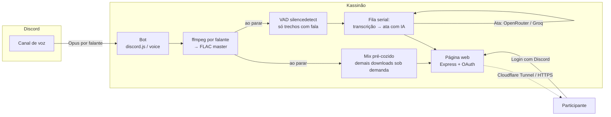

<div align="center">

# Kassinão 🎙️

### Cada pessoa grava na própria faixa. Ninguém aqui chuta quem falou.

**🌎 Idioma:** [English](README.md) · **Português (BR)**

[](LICENSE)
[](CONTRIBUTING.md)
[](https://github.com/resolvicomai/kassinao/stargazers)

<br/>

[](https://kassinao.resolvicomai.app/demo)

Reunião fictícia, **sem precisar logar**: um chip colorido por participante, player de áudio, card de ata com resumo/decisões/ações e a transcrição inteira colorida por quem falou, com timestamp clicável — a mesma página que qualquer gravação sua vai gerar.

<sub>Prefere ler puro texto? A mesma transcrição e ata estão em [`docs/example/`](docs/example/), direto no repositório.</sub>

</div>

---

A maioria das ferramentas de IA para reunião infere quem está falando a partir do padrão de voz — e erra toda vez que duas pessoas falam junto ou um nome foge do inglês. O Kassinão pula essa inferência: cada pessoa da call grava numa faixa de áudio própria, então a transcrição, a ata e o `/perguntar` sempre sabem, com certeza, quem disse o quê.

## Sumário

- [Sabe quem falou](#sabe-quem-falou)
- [Vira memória que responde](#vira-memória-que-responde)
- [É seu, com controle real](#é-seu-com-controle-real)
- [Comece agora](#comece-agora)
- [Como se compara](#como-se-compara)
- [Referência](#referência)
- [Como funciona por dentro](#como-funciona-por-dentro)
- [Segurança e privacidade](#segurança-e-privacidade)

## Sabe quem falou

- Uma faixa de áudio própria por pessoa (FLAC, perfeitamente sincronizada) — não é diarização adivinhada por IA.
- VAD real: só o trecho com fala de cada faixa vai pra API, então silêncio não custa nem gera alucinação.
- Motor de transcrição plugável — AssemblyAI, Groq, OpenAI, Gemini ou um comando local, pra privacidade total.
- Nomes de quem estava na call e vocabulário da equipe entram sozinhos no motor, pra sotaque e termos técnicos saírem certos.
- Roda sozinha depois do `/parar` — a transcrição com nome de quem falou e timestamp chega sem apertar mais nada.

## Vira memória que responde

- Ata por IA: resumo, decisões e itens de ação com responsável e prazo, gerada sozinha depois de cada reunião.
- A ata chega no canal do Discord assim que fica pronta — sem precisar abrir a página.
- `/perguntar` responde dentro do próprio Discord, com citação `[hh:mm:ss]` clicável, usando só as reuniões que você pode ver.
- Índice web com busca full-text em transcrições, atas e notas — cada resultado linka pro segundo exato.
- O mesmo acervo conecta no Claude Desktop, Cursor ou outro assistente compatível, via MCP.

> Exemplo: _"o que ficou pendente essa semana, e de quem?"_ — o `/perguntar` (ou o conector MCP) cruza itens de ação com prazo de várias reuniões e responde só com o que você tem direito de ver.

## É seu, com controle real

- Self-hosted: roda no seu Docker, seus dados não passam pela infraestrutura de ninguém.
- Acesso liberado por login no Discord + participação real na call — nunca por "quem tem o link".
- Retenção do seu jeito: só o áudio expira, ou nada expira — você decide o que vira memória permanente.
- Painel ao vivo no canal (parar, marcar nota/momento com um clique) e indicador `[GRAVANDO]` visível pra quem está na call.
- Auto-record liga sozinho quando alguém entra no canal, é bilíngue (pt-BR/inglês) e roda sob código aberto AGPL-3.0-or-later.

## Comece agora

Precisa de um servidor com **Docker** e de um **app criado no Discord** — é rápido, veja o [passo 1](#1-criar-o-app-do-bot-no-discord) abaixo.

> Faça o passo 1 primeiro: sem `DISCORD_TOKEN` o bot nem sobe.

```bash
git clone https://github.com/resolvicomai/kassinao.git && cd kassinao
cp .env.example .env      # preencha DISCORD_TOKEN, APPLICATION_ID, DISCORD_CLIENT_SECRET, BASE_URL
docker compose up -d --build
```

Depois **convide o bot** (passo 1) e rode **`/gravar`** num canal de voz. Pronto — o passo a passo completo está logo abaixo.

> ☁️ **Deploy em 1 clique:** [](https://render.com/deploy?repo=https://github.com/resolvicomai/kassinao) — blueprint em [`render.yaml`](render.yaml). Defina `GROQ_API_KEY` + `TRANSCRIBE_PROVIDER=groq` no painel do Render pra já subir com transcrição e ata ligadas.
> Evite serverless (Vercel/Netlify): o gateway de voz do Discord precisa de um WebSocket sempre ativo.

### 1. Criar o app do bot no Discord

1. Em <https://discord.com/developers/applications> → **New Application** → dê um nome.
2. **General Information**: copie o **Application ID** → `APPLICATION_ID`.
3. **Bot** → **Reset Token** → copie → `DISCORD_TOKEN`. (Nenhuma _privileged intent_ é necessária.)
4. **OAuth2** → copie o **Client Secret** → `DISCORD_CLIENT_SECRET`.
5. **OAuth2 → Redirects** → adicione `SUA_BASE_URL/auth/callback` (ex.: `https://kassinao.seu-dominio.com/auth/callback`). Sem isso, o login da página falha.
6. Convide o bot (troque `SEU_APP_ID`):
   ```
   https://discord.com/oauth2/authorize?client_id=SEU_APP_ID&scope=bot%20applications.commands&permissions=68176896
   ```
   Permissões: Ver Canais, Enviar Mensagens, Inserir Links, Conectar, Alterar Apelido.
   > Em canais **restritos**, libere o bot no próprio canal (Ver Canal + Conectar), ou dê a ele um cargo com acesso.

### 2. Deixar o bot acessível (escolha um)

**Opção A — Cloudflare Tunnel (recomendado: HTTPS, sem abrir portas)**

1. Em <https://one.dash.cloudflare.com> → **Networks → Tunnels → Create a tunnel → Cloudflared**.
2. Dê um nome, copie o **token** (`eyJ...`) → `TUNNEL_TOKEN` no `.env`.
3. Em **Public Hostname**: subdomínio + seu domínio, **Type = HTTP**, **URL = `kassinao:8080`**.
4. No `.env`, defina **as duas** variáveis: `BASE_URL=https://SEU_SUBDOMINIO.seu-dominio.com` **e** `COMPOSE_PROFILES=tunnel`.
   O serviço `cloudflared` do compose fica sob o profile `tunnel` e **não sobe sozinho** — sem o `COMPOSE_PROFILES=tunnel` (ou `docker compose --profile tunnel up -d`), o túnel simplesmente não inicia.

**Opção B — IP direto (só dev/teste, sem HTTPS)**

- No `.env`: `BASE_URL=http://SEU_IP:8080` e publique a porta 8080 (descomente o `ports` no `docker-compose.yml`). Não precisa mexer no serviço `cloudflared`: sem o profile `tunnel` ele nem sobe.
- ⚠️ O OAuth do Discord só aceita redirect `https` (ou `localhost`), então o **login e os downloads da página não funcionam via IP puro** — para uso real, use o túnel (ou qualquer proxy HTTPS).

### 3. Subir

```bash
docker compose up -d --build
docker compose logs -f     # deve mostrar "Kassinão online como ..."
```

As gravações ficam em `./recordings` (volume — sobrevivem a rebuilds).

### 4. (Opcional) Ligar transcrição + ata

Melhor qualidade em pt-BR (AssemblyAI para a voz; ata num modelo de contexto gigante via OpenRouter):

```env
TRANSCRIBE_PROVIDER=assemblyai
ASSEMBLYAI_API_KEY=...        # https://www.assemblyai.com — US$50 de crédito grátis
GROQ_API_KEY=gsk_...          # opcional: fallback da transcrição (https://console.groq.com)
OPENROUTER_API_KEY=sk-or-...  # https://openrouter.ai — LLM da ata (padrão google/gemini-2.5-flash)
MINUTES_ENABLED=auto
```

Caminho 100% grátis: `TRANSCRIBE_PROVIDER=groq` só com a `GROQ_API_KEY` (free tier: 8h de áudio/dia; a ata roda no LLM free da Groq, em map-reduce nas calls longas).

> 🔒 **Privacidade:** no painel da Groq, ligue o **Zero Data Retention (ZDR)** para o áudio não ser retido. Ou use o motor **local** (`TRANSCRIBE_PROVIDER=command`) para o áudio nunca sair do servidor.

## Como se compara

Craig grava. Otter resume. O Kassinão sabe quem falou.

|                                                     | **Kassinão** |  Craig   | Otter / Fireflies |
| --------------------------------------------------- | :----------: | :------: | :---------------: |
| Multipista (um arquivo por pessoa)                  |      ✅      |    ✅    |        ❌         |
| Atribuição perfeita de quem falou (sem diarização)  |      ✅      |    ✅    |    ❌ (chuta)     |
| Ata por IA (resumo, decisões, tarefas)              |      ✅      |    ❌    |        ✅         |
| Detalhamento por participante                       |      ✅      |    ❌    |        ⚠️         |
| Self-hosted / o dado é seu                          |      ✅      |    ⚠️    |        ❌         |
| Acesso por login (não "quem tem o link")            |      ✅      |    ⚠️    |        ✅         |
| Código aberto (AGPL-3.0)                            |      ✅      |    ✅    |        ❌         |
| Preço                                               |    Grátis    | Freemium |       Pago        |

## Referência

Consulta rápida pós-instalação — não precisa ler isso pra decidir se instala, só quando for configurar.

### Configuração (`.env`)

Todas as opções estão comentadas, uma a uma, em [`.env.example`](.env.example). Aqui vão as principais:

| Variável | Padrão | Descrição |
|---|---|---|
| `DISCORD_TOKEN` | — | Token do bot |
| `APPLICATION_ID` | — | ID da aplicação |
| `DISCORD_CLIENT_SECRET` | — | Client Secret (login OAuth da página) |
| `GUILD_ID` | — | Registra comandos na hora nesse servidor (sem ele, usa os servidores em que o bot está) |
| `BASE_URL` | `http://localhost:8080` | URL pública dos links e do OAuth |
| `REPO_PUBLIC` | `false` | `true` exibe os links do GitHub/código-fonte e o selo "auditável" na landing page |
| `TUNNEL_TOKEN` | — | Token do Cloudflare Tunnel (Opção A; defina também `COMPOSE_PROFILES=tunnel`) |
| `PORT` | `8080` | Porta do servidor web |
| `RECORDINGS_DIR` | `./recordings` | Onde salvar as gravações |
| `RETENTION_DAYS` | `7` | Dias até o **áudio** da gravação expirar (`0` = ilimitado: nada expira, apagar é só manual) |
| `TEXT_RETENTION_DAYS` | `90` | Quanto tempo transcrição/ata/notas sobrevivem ao áudio (nunca menor que `RETENTION_DAYS`; `0` = pra sempre) |
| `MAX_RECORDING_HOURS` | `6` | Duração máxima por gravação |
| `MP3_BITRATE` | `192k` | Bitrate dos MP3 |
| `COOKIE_SECRET` | gerado | Segredo dos cookies de sessão (mín. 32 bytes se definido manualmente) |
| `TZ` | `America/Sao_Paulo` | Fuso das datas (a página usa o do navegador) |
| `DEFAULT_LOCALE` | `en` | Idioma padrão quando não há locale do usuário (ex.: DM); dentro dos servidores, cada pessoa vê no idioma do próprio Discord |
| `TRANSCRIBE_PROVIDER` | `none` | `none` / `assemblyai` / `openai` / `groq` / `gemini` / `command` |
| `TRANSCRIBE_MODEL` | por provider | Ex.: `universal-3-5-pro` (assemblyai), `whisper-large-v3` (groq) |
| `TRANSCRIBE_LANGUAGE` | `pt` | Idioma falado nas calls |
| `TRANSCRIBE_PROMPT` | — | Contexto pro motor de ASR (vocabulário/nomes/estilo) — funciona no Whisper e no _keyterms_ do AssemblyAI |
| `TRANSCRIBE_KEYTERMS` | — | Vocabulário fixo da equipe (AssemblyAI Universal-3.5-Pro): produtos, siglas, nomes de projeto — os nomes dos participantes já entram sozinhos |
| `TRANSCRIBE_COMMAND` | — | Comando local com `{input}`/`{output}` (provider `command`) |
| `TRANSCRIBE_TIMEOUT_FACTOR` | `5` | Watchdog do provider `command` |
| `ASSEMBLYAI_API_KEY` / `OPENAI_API_KEY` / `GROQ_API_KEY` / `GEMINI_API_KEY` | — | Chave do provider escolhido (a da Groq também serve de fallback) |
| `MINUTES_ENABLED` | `auto` | Ata com IA: `auto` (liga com `OPENROUTER_API_KEY` ou `GROQ_API_KEY`) / `true` / `false` |
| `MINUTES_PROVIDER` / `OPENROUTER_API_KEY` | `openrouter` c/ chave | LLM da ata: `openrouter` (padrão `google/gemini-2.5-flash`) ou `groq` (padrão `llama-3.3-70b-versatile`) |
| `MINUTES_MAX_TOKENS` | `8192` | Teto de tokens da ata |
| `MINUTES_WEBHOOK_URL` | — | POSTa um JSON (`minutes.ready`) por reunião pra sua integração; só configurável por env, de propósito (evita SSRF via Discord) |
| `MCP_SECRET` | — | Liga o conector MCP (Claude/Cursor). Defina um segredo forte pra ativar; girar o valor revoga todos os conectores de uma vez |
| `OWNER_IDS` | — | IDs do Discord com acesso ao `/mcp` (CSV); membros comuns se conectam sozinhos em `/app/conectar-ia` |
| `MCP_ACCESS_TTL_MIN` / `MCP_REFRESH_TTL_DAYS` | `15` / `30` | Validade do token de acesso (minutos) e do refresh (dias) do conector MCP |

Tem mais: guarda de espaço em disco, alerta de disco cheio, backup automático via rclone — tudo comentado, uma opção por vez, em [`.env.example`](.env.example).

Transcrição 100% local: com `TRANSCRIBE_PROVIDER=command` o áudio nunca sai do servidor. Wrapper pronto para faster-whisper em [`scripts/transcribe-local.py`](scripts/transcribe-local.py):

```env
TRANSCRIBE_PROVIDER=command
TRANSCRIBE_COMMAND=python3 ./scripts/transcribe-local.py {input} {output}
```

No Docker, construa com Python + faster-whisper na imagem: `docker compose build --build-arg LOCAL_TRANSCRIBE=1`. Qualquer comando serve, desde que escreva em `{output}` um JSON `[{"start":s,"end":s,"text":"..."}]`.

### Comandos

| pt-BR | inglês | o que faz |
|---|---|---|
| `/gravar [canal]` | `/record [channel]` | Começa a gravar (seu canal de voz, ou o indicado) |
| `/parar` | `/stop` | Encerra e gera o link com áudio, transcrição e ata |
| `/nota <texto>` | `/note <text>` | Marca uma nota no tempo atual (ou botão 📝 do painel) |
| `/status` | `/status` | Estado da gravação em andamento |
| `/gravacoes` | `/recordings` | Suas últimas gravações, com links (filtradas por acesso) — também linka pro índice web com busca full-text |
| `/perguntar <pergunta> [dias]` | `/ask <question> [days]` | Pergunte às suas reuniões — a IA responde (só você vê) com citações no segundo exato, usando as transcrições que você pode acessar |
| `/config ata-canal/ver` | `/config minutes-channel/view` | Admin: escolhe o canal de texto onde a ata resumida é postada (padrão: chat do canal de voz) |
| `/autorecord ligar/desligar/ver` | `/autorecord on/off/view` | Gravação automática por canal (admin) |
| `/mcp novo/revogar-tudo` | `/mcp new/revoke-all` | Só o dono do bot (`OWNER_IDS`): gera ou revoga o código de conexão do assistente de IA — membros comuns se conectam sozinhos em `/app/conectar-ia` |
| `/ajuda` | `/help` | Guia interativo (também responde por DM) |
| `/sobre` | `/about` | Autor, licença e link do código-fonte |

Qualquer membro grava e para. `/autorecord` e `/config` exigem **Gerenciar Servidor**. Apagar uma gravação (pela página) é restrito a quem iniciou ou a admins. `/mcp` só existe quando o conector está ligado (`MCP_SECRET` definido).

### Motores de transcrição

| Provedor | Custo (por hora de fala, **por faixa**) | Qualidade em pt-BR | Privacidade | Notas |
|---|---|---|---|---|
| **AssemblyAI** (`universal-3-5-pro`) | ~US$0,21 (**US$50 de crédito grátis**) | Top-3 no Open ASR Leaderboard | Nuvem | Escolha padrão; cai pro Groq sozinho se houver `GROQ_API_KEY` |
| **Groq** (`whisper-large-v3`) | ~US$0,11 (free tier: 8h de áudio/dia) | Excelente | Nuvem (ligue o ZDR) | Melhor opção 100% grátis |
| **OpenAI** (`whisper-1`) | ~US$0,36 | Excelente | Nuvem | Segmentos com timestamp |
| **Gemini** (`gemini-2.0-flash`, padrão) | ~centavos | Boa | Nuvem (só no tier pago) | O tier grátis treina modelo com seu áudio — evite |
| **Local** (`faster-whisper`) | Grátis | Boa (`small` ou maior) | 🔒 Nunca sai do seu servidor | Mais lento sem GPU; veja [`scripts/transcribe-local.py`](scripts/transcribe-local.py) |

> 💡 A gravação é multipista, mas só a **fala** é enviada — o VAD corta o silêncio de cada faixa antes do envio — então uma call de 1h custa perto do tempo total falado, não horas × pessoas. A ata roda uma vez por reunião (OpenRouter ou Groq), poucos centavos no total.

## Como funciona por dentro

Cada falante manda pacotes Opus pro `@discordjs/voice`, que são decodificados em PCM e alimentam **um ffmpeg por pessoa** gravando **FLAC contínuo** (o silêncio entre falas comprime a quase nada e mantém tudo sincronizado). Ao encerrar, o **mix já sai pré-cozido** — o player toca na hora, sem esperar minutos no primeiro clique; os demais downloads (MP3/FLAC/Audacity) são gerados sob demanda, com cache. Transcrição e ata rodam numa **fila serial** depois da call: o **VAD** (`silencedetect` do ffmpeg) recorta cada faixa e só os trechos com fala vão pra API de transcrição escolhida; a ata roda em seguida num LLM via OpenRouter ou Groq. A página se atualiza sozinha até tudo ficar pronto, e autentica com **OAuth2 do Discord** — o backend confere no Discord, a cada acesso, se a pessoa pode abrir aquela gravação.



**Stack:** Node.js + TypeScript · discord.js / @discordjs/voice · Express · ffmpeg · Docker · Cloudflare Tunnel.

## Segurança e privacidade

Gravar voz é tratar **dado pessoal** — o design parte disso, não é um adendo:

- **Controle de acesso é código, não convenção.** Toda checagem — página web, central privada `/app`, API do conector MCP — passa pela mesma função em [`src/web/access.ts`](src/web/access.ts): só vê quem **iniciou a gravação**, **esteve na call** (falando ou mutado), **enxerga o canal de voz de origem**, ou tem **Gerenciar Servidor**; apagar é restrito a quem iniciou ou a admins. Não existe um caminho "por disco" que pule essa regra.
- **Falha pro lado seguro.** Se o cache do Discord está frio (gateway reiniciando, rate limit), a página nunca _concede_ um acesso que não conseguiu confirmar — ela nega, e no caminho do conector MCP devolve um erro retriável (503) em vez de um 403 que poderia esconder um acesso legítimo.
- **Consentimento visível.** O apelido do bot vira `[GRAVANDO]` durante a call e um painel aparece no canal — ninguém é gravado sem saber.
- **O conector MCP não amplia acesso.** O token carrega só identidade — a regra de visibilidade é a mesma da web; o texto das reuniões chega ao seu assistente marcado como "dado não confiável" (defesa contra prompt-injection); girar o `MCP_SECRET` revoga todos os conectores na hora.
- **Áudio não precisa passar por terceiros.** Ligue **Zero Data Retention** no provedor de transcrição escolhido, ou rode o motor **local** (`TRANSCRIBE_PROVIDER=command`) pra o áudio nunca sair do seu servidor.
- **Segredos ficam só no seu `.env`** (já no `.gitignore` por padrão) — nunca comitados, nunca em log. Reportar uma vulnerabilidade: [SECURITY.md](SECURITY.md).

## Desenvolvimento

```bash
npm install
cp .env.example .env
npm run dev     # reload automático
npm run build   # compila para dist/
```

## Contribuindo

Issues e PRs são bem-vindos. Rode `npm run build` antes de abrir um PR.

## Licença

[GNU AGPL-3.0-or-later](LICENSE) © 2026 Mauro Marques (resolvicomai).

Software livre e de código aberto: você pode usar, estudar, modificar e
compartilhar — mas se rodar uma versão modificada como serviço de rede (ex.:
hospedar o bot para outras pessoas), a AGPL te obriga a oferecer o código-fonte
correspondente a esses usuários. O comando `/sobre` do bot já linka este
repositório para cumprir isso.

Usa o [ffmpeg](https://ffmpeg.org/) (via `ffmpeg-static`, GPL/LGPL) como binário
externo separado; a licença própria dele se aplica a esse binário.
