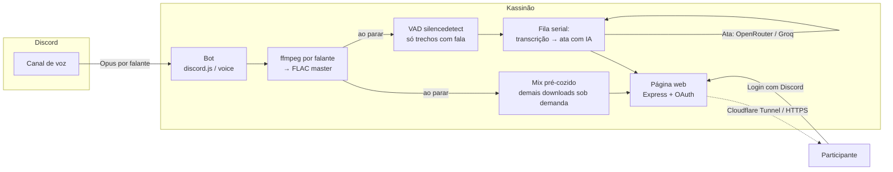

# Kassinão 🎙️

**🌎 Idioma:** [English](README.md) · **Português (BR)**

> Grava as calls do Discord. Depois é só perguntar.
>
> Uma faixa por pessoa, **transcrição com o nome exato de quem falou**, **ata** (resumo, decisões, itens de ação) automática — e as reuniões viram memória que responde, com **/perguntar** no Discord, busca na web ou qualquer assistente de IA com MCP.

Um gravador de voz multi-track para Discord, auto-hospedado, inspirado no [Craig](https://craig.chat/) — com as principais features "premium" liberadas e um extra que nenhum concorrente entrega bem: como cada participante tem uma faixa de áudio separada, a **atribuição de quem falou o quê é perfeita** (sem diarização por IA, que é onde Otter/Fireflies erram).

🔗 **Demo ao vivo (sem instalar nada):** <https://kassinao.resolvicomai.app/demo> — reunião fictícia com transcrição, ata e player. E dá pra **conectar ao seu assistente de IA** (Claude/Cursor) — veja [Conector de IA](#-conector-de-ia-mcp).

<!-- Dica: adicione aqui um screenshot da página da gravação (docs/pagina.png) -->

---

## ✨ Features

- **🎚️ Multipista de verdade** — uma faixa FLAC (lossless) separada por pessoa, todas na mesma linha do tempo.
- **📝 Transcrição automática** — com o nome de quem falou e horários. Motor plugável: **AssemblyAI**, **Groq**, **OpenAI**, **Gemini** ou **comando local** (faster-whisper/whisper.cpp) para privacidade total. **VAD de verdade**: só a fala vai pra API (sem custo com silêncio, sem alucinação de silêncio), com retomada automática se o provedor limitar.
- **📋 Ata com IA** — resumo, decisões, itens de ação (com responsável/prazo), tópicos com horário e **um bloco por participante**. Gerada por LLM sobre a transcrição.
- **🔊 Página web da gravação** — player fixo com **velocidade 1×/1.5×/2×**, transcrição agrupada por falante com **cores por pessoa**, **busca/filtro** dentro da transcrição, acompanhamento estilo karaokê, barra do tempo clicável, copiar itens de ação com um clique, downloads em **MP3 / FLAC / Mix único / projeto Audacity** — tudo protegido por **login com Discord**.
- **🗂️ Índice web com busca** — `/gravacoes` na web lista tudo que você pode acessar em todos os servidores, com filtro por canal e **busca full-text** em transcrições, atas e notas — cada resultado linka pro segundo exato.
- **💬 `/perguntar` no próprio Discord** — pergunte às suas reuniões sem sair do Discord; a IA responde (efêmero, só você vê) usando apenas as transcrições que VOCÊ pode acessar, com citações `[hh:mm:ss]` pro minuto certo. Opção `dias:` (janela, padrão 30). Requer a ata por IA habilitada (chave OpenRouter ou Groq).
- **📤 Ata resumida no Discord** — quando a ata fica pronta, o bot posta um embed com resumo, decisões e itens de ação direto no Discord (sem precisar de login); o admin escolhe o canal com `/config ata-canal` (sem configurar, vai pro chat do canal de voz). E o `MINUTES_WEBHOOK_URL` dispara um webhook JSON por reunião pra integrações self-hosted (n8n → Notion/Jira…).
- **🔒 Acesso restrito de verdade** — só abre para quem **estava na call** (falando ou mutado), **enxerga o canal**, **iniciou** a gravação ou é **admin**. Link vazado não dá acesso a estranhos.
- **🎛️ Painel ao vivo** no chat do canal de voz — log de eventos, botões de **Parar**, **Nota** e **📌 Marcar momento** (um clique carimba o timestamp, sem digitar nada), indicador `[GRAVANDO]` no apelido do bot (consentimento visível).
- **🗒️ Notas com timestamp** (`/nota` ou botão) — entram no painel, na transcrição, na ata e nos labels do projeto Audacity.
- **🔌 Conector MCP** *(opcional)* — pergunte sobre suas reuniões pelo **Claude Desktop/Cursor**: janela de tempo, **itens de ação com prazo** cruzando reuniões, busca full-text — cada um só vê o que já poderia ver. Veja [`mcp/`](mcp/).
- **🤖 Auto-record** — começa a gravar sozinho quando N pessoas entram num canal e para quando esvazia.
- **⏳ Retenção em camadas** — o `RETENTION_DAYS` expira só o **áudio**; transcrição, ata e notas vivem `TEXT_RETENTION_DAYS` (padrão 90 dias) — a busca, o `/perguntar` e o conector MCP continuam funcionando depois que o áudio se foi.
- **❓ Onboarding embutido** — `/ajuda` com botões interativos por tópico; mandar DM ao bot também responde o guia.
- **🌎 Bilíngue** (pt-BR / inglês, pelo idioma de cada usuário) e **cadeado HTTPS** via Cloudflare Tunnel (sem abrir portas).
- Robustez: aviso de silêncio, parada automática (limite de horas / canal vazio / desconexão), expiração automática, recuperação pós-reinício e shutdown gracioso.

## 🧭 Comandos

| pt-BR | inglês | o que faz |
|---|---|---|
| `/gravar [canal]` | `/record [channel]` | Começa a gravar (seu canal de voz, ou o indicado) |
| `/parar` | `/stop` | Encerra e gera o link com áudio, transcrição e ata |
| `/nota <texto>` | `/note <text>` | Marca uma nota no tempo atual (ou botão 📝 do painel) |
| `/status` | `/status` | Estado da gravação em andamento |
| `/gravacoes` | `/recordings` | Suas últimas gravações, com links (filtradas por acesso) — também linka pro índice web com busca full-text |
| `/perguntar <pergunta> [dias]` | `/ask <question> [days]` | Pergunte às suas reuniões — a IA responde (só você vê) com citações no segundo exato, usando as transcrições que você pode acessar |
| `/config ata-canal/ver` | `/config minutes-channel/view` | Admin: escolhe o canal de texto onde a ata resumida é postada (padrão: chat do canal de voz) |
| `/ajuda` | `/help` | Guia interativo (também responde por DM) |
| `/autorecord ligar/desligar/ver` | `/autorecord on/off/view` | Gravação automática por canal (admin) |
| `/mcp novo/revogar-tudo` | `/mcp new/revoke-all` | Conectar/revogar seu assistente de IA (quando o MCP está ligado) |

Qualquer membro grava e para. `/autorecord` e `/config` exigem **Gerenciar Servidor**. Apagar uma gravação (pela página) é restrito a quem iniciou ou a admins.

---

## 🔌 Conector de IA (MCP)

*Opcional, desligado por padrão.* Plugue suas reuniões no **Claude Desktop, Cursor** ou outro cliente MCP e pergunte em linguagem natural:

- *"O que ficou pendente essa semana, e de quem?"* — junta itens de ação com prazo de várias reuniões.
- *"Lista as calls deste canal entre 1 e 30 de junho."* — busca por janela de tempo (ciente do fuso).
- *"Quando a Ana falou de orçamento? Me dá o link."* — busca com link no segundo exato.

**Seguro por construção:** o conector roda na sua máquina e carrega só um **token pessoal**; o bot aplica o *mesmo* controle de acesso da página, reunião por reunião — cada pessoa só vê o que já veria no site. Somente leitura, sem áudio, revogável. O conteúdo das reuniões vai embrulhado como "dados não-confiáveis" (defesa contra prompt-injection).

Para ligar, defina `MCP_SECRET` (segredo forte, **≠** `COOKIE_SECRET`). Cada pessoa se conecta sozinha em `/conectar-ia`. Pacote e docs completos: [`mcp/`](mcp/). Pro caso básico ("o que decidimos?") nem precisa de MCP — o `/perguntar` responde dentro do próprio Discord.

---

## 🚀 Instalação (do zero)

### Pré-requisitos
- Um servidor (VPS) com **Docker** e **Docker Compose**.
- Uma conta no **Discord**.
- *(Recomendado)* Um **domínio na Cloudflare** para ter HTTPS sem abrir portas. *(Alternativa: usar o IP do VPS direto.)*

### 1. Criar o app do bot no Discord
1. Em <https://discord.com/developers/applications> → **New Application** → dê um nome.
2. **General Information**: copie o **Application ID** → `APPLICATION_ID`.
3. **Bot** → **Reset Token** → copie → `DISCORD_TOKEN`. (Nenhuma *privileged intent* é necessária.)
4. **OAuth2** → copie o **Client Secret** → `DISCORD_CLIENT_SECRET`.
5. **OAuth2 → Redirects** → adicione `SUA_BASE_URL/auth/callback` (ex.: `https://kassinao.seu-dominio.com/auth/callback`). Sem isso, o login da página falha.
6. Convide o bot (troque `SEU_APP_ID`):
   ```
   https://discord.com/oauth2/authorize?client_id=SEU_APP_ID&scope=bot%20applications.commands&permissions=68176896
   ```
   Permissões: Ver Canais, Enviar Mensagens, Inserir Links, Conectar, Alterar Apelido.
   > Em canais **restritos**, libere o bot no próprio canal (Ver Canal + Conectar), ou dê a ele um cargo com acesso.

### 2. Pegar o código e configurar
```bash
git clone https://github.com/resolvicomai/kassinao.git && cd kassinao
cp .env.example .env
# edite o .env (veja a tabela de configurações abaixo)
```

### 3. Como o bot fica acessível (escolha um)

**Opção A — Cloudflare Tunnel (recomendado: HTTPS, sem abrir portas)**
1. Em <https://one.dash.cloudflare.com> → **Networks → Tunnels → Create a tunnel → Cloudflared**.
2. Dê um nome, copie o **token** (`eyJ...`) → `TUNNEL_TOKEN` no `.env`.
3. Em **Public Hostname**: subdomínio + seu domínio, **Type = HTTP**, **URL = `kassinao:8080`**.
4. No `.env`, defina **as duas** variáveis: `BASE_URL=https://SEU_SUBDOMINIO.seu-dominio.com` **e** `COMPOSE_PROFILES=tunnel`.
   O serviço `cloudflared` do compose fica sob o profile `tunnel` e **não sobe sozinho** — sem o `COMPOSE_PROFILES=tunnel` (ou `docker compose --profile tunnel up -d`), o túnel simplesmente não inicia.

**Opção B — IP direto (só dev/teste, sem HTTPS)**
- No `.env`: `BASE_URL=http://SEU_IP:8080` e publique a porta 8080 (descomente o `ports` no `docker-compose.yml`). Não precisa mexer no serviço `cloudflared`: sem o profile `tunnel` ele nem sobe.
- ⚠️ O OAuth do Discord só aceita redirect `https` (ou `localhost`), então o **login e os downloads da página não funcionam via IP puro** — para uso real, use o túnel (ou qualquer proxy HTTPS).

### 4. Subir
```bash
docker compose up -d --build
docker compose logs -f     # deve mostrar "Kassinão online como ..."
```
As gravações ficam em `./recordings` (volume — sobrevivem a rebuilds). Rode `/gravar` num canal de voz e pronto.

### 5. *(Opcional)* Ligar transcrição + ata
Melhor qualidade em pt-BR (AssemblyAI para a voz; ata num modelo de contexto gigante via OpenRouter):
```env
TRANSCRIBE_PROVIDER=assemblyai
ASSEMBLYAI_API_KEY=...        # https://www.assemblyai.com — US$50 de crédito grátis
GROQ_API_KEY=gsk_...          # opcional: fallback da transcrição (https://console.groq.com)
OPENROUTER_API_KEY=sk-or-...  # https://openrouter.ai — LLM da ata (padrão google/gemini-2.5-flash)
MINUTES_ENABLED=auto
```
Caminho 100% grátis: `TRANSCRIBE_PROVIDER=groq` só com a `GROQ_API_KEY` (free tier: 8h de áudio/dia; a ata roda no LLM free da Groq, em map-reduce nas calls longas).
> 🔒 **Privacidade:** no painel da Groq, ligue o **Zero Data Retention (ZDR)** para o áudio não ser retido. Ou use o motor **local** (`TRANSCRIBE_PROVIDER=command`) para o áudio nunca sair do servidor.

Custo de referência da transcrição (por hora de FALA — o silêncio das faixas não é enviado): AssemblyAI ~US$0,21 (US$50 grátis) · Groq ~US$0,11 (free tier 8h/dia) · OpenAI ~US$0,36. A ata custa centavos por reunião.

---

## ⚙️ Configuração (`.env`)

| Variável | Padrão | Descrição |
|---|---|---|
| `DISCORD_TOKEN` | — | Token do bot |
| `APPLICATION_ID` | — | ID da aplicação |
| `DISCORD_CLIENT_SECRET` | — | Client Secret (login OAuth da página) |
| `GUILD_ID` | — | Registra comandos na hora nesse servidor (sem ele, usa os servidores em que o bot está) |
| `BASE_URL` | `http://localhost:8080` | URL pública dos links e do OAuth |
| `REPO_PUBLIC` | `false` | `true` exibe os links do GitHub/código-fonte e o selo "auditável" na landing page |
| `TUNNEL_TOKEN` | — | Token do Cloudflare Tunnel (Opção A; defina também `COMPOSE_PROFILES=tunnel`) |
| `PORT` | `8080` | Porta do servidor web |
| `RECORDINGS_DIR` | `./recordings` | Onde salvar as gravações |
| `RETENTION_DAYS` | `7` | Dias até o **áudio** da gravação expirar |
| `TEXT_RETENTION_DAYS` | `90` | Quanto tempo transcrição/ata/notas sobrevivem ao áudio (nunca menor que `RETENTION_DAYS`) |
| `MAX_RECORDING_HOURS` | `6` | Duração máxima por gravação |
| `MP3_BITRATE` | `192k` | Bitrate dos MP3 |
| `COOKIE_SECRET` | gerado | Segredo dos cookies de sessão |
| `TZ` | `America/Sao_Paulo` | Fuso das datas (a página usa o do navegador) |
| `TRANSCRIBE_PROVIDER` | `none` | `none` / `assemblyai` / `openai` / `groq` / `gemini` / `command` |
| `TRANSCRIBE_MODEL` | por provider | Ex.: `universal-3-5-pro` (assemblyai), `whisper-large-v3` (groq) |
| `TRANSCRIBE_LANGUAGE` | `pt` | Idioma falado nas calls |
| `TRANSCRIBE_COMMAND` | — | Comando local com `{input}`/`{output}` (provider `command`) |
| `TRANSCRIBE_TIMEOUT_FACTOR` | `5` | Watchdog do provider `command` |
| `ASSEMBLYAI_API_KEY` / `OPENAI_API_KEY` / `GROQ_API_KEY` / `GEMINI_API_KEY` | — | Chave do provider escolhido (a da Groq também serve de fallback) |
| `MINUTES_ENABLED` | `auto` | Ata com IA: `auto` (liga com OPENROUTER_API_KEY ou GROQ_API_KEY) / `true` / `false` |
| `MINUTES_PROVIDER` / `OPENROUTER_API_KEY` | `openrouter` c/ chave | LLM da ata: `openrouter` (padrão `google/gemini-2.5-flash`) ou `groq` |
| `MINUTES_MAX_TOKENS` | `8192` | Teto de tokens da ata |
| `MINUTES_WEBHOOK_URL` | — | POSTa um JSON (`minutes.ready`) por reunião pra sua integração; só configurável por env, de propósito (evita SSRF via Discord) |

### Transcrição local (privacidade total)
Com `TRANSCRIBE_PROVIDER=command` o áudio nunca sai do servidor. Wrapper pronto para faster-whisper em [`scripts/transcribe-local.py`](scripts/transcribe-local.py):
```env
TRANSCRIBE_PROVIDER=command
TRANSCRIBE_COMMAND=python3 ./scripts/transcribe-local.py {input} {output}
```
No Docker, construa com Python + faster-whisper na imagem: `docker compose build --build-arg LOCAL_TRANSCRIBE=1`. Qualquer comando serve, desde que escreva em `{output}` um JSON `[{"start":s,"end":s,"text":"..."}]`.

---

## 🔐 Segurança e privacidade (LGPD)

- Gravar voz é tratar **dado pessoal**. Avise os participantes (o bot já mostra `[GRAVANDO]` no apelido e um painel no canal) e defina uma política de retenção (`RETENTION_DAYS`).
- O acesso às gravações é sempre validado por login no Discord + participação/visibilidade do canal — nunca por "quem tem o link".
- Prefira **ZDR** (Groq) ou o **motor local** para que o áudio não seja retido por terceiros.
- **Nunca comite o `.env`** (já está no `.gitignore`). As chaves ficam só no servidor.

## 🧠 Como funciona por dentro

- Recebe os pacotes Opus de cada falante via `@discordjs/voice`, decodifica para PCM e alimenta **um ffmpeg por falante** gravando **FLAC contínuo** (silêncio entre falas comprime a quase nada e mantém tudo sincronizado).
- Ao encerrar a gravação, o **mix já é pré-cozinhado** — o player toca na hora, sem esperar minutos no primeiro clique. Os demais downloads (MP3/FLAC/Audacity) continuam sendo gerados sob demanda, com cache.
- Transcrição e ata rodam numa **fila serial** após a gravação: o **VAD** (`silencedetect` do ffmpeg) recorta cada faixa e **só os trechos com fala** vão pra API de transcrição (**AssemblyAI** — com fallback pra Groq —, **Groq**, **OpenAI**, **Gemini** ou **comando local**); a ata roda em seguida num LLM via **OpenRouter** ou **Groq**. A página se atualiza sozinha até tudo ficar pronto.
- A página autentica com **OAuth2 do Discord** (escopo `identify`) e o backend confere no Discord se a pessoa pode acessar aquela gravação.



**Stack:** Node.js + TypeScript · discord.js / @discordjs/voice · Express · ffmpeg · Docker · Cloudflare Tunnel.

## 💻 Desenvolvimento
```bash
npm install
cp .env.example .env
npm run dev     # reload automático
npm run build   # compila para dist/
```

## 🤝 Contribuindo
Issues e PRs são bem-vindos. Rode `npm run build` antes de abrir um PR.

## 📄 Licença
[GNU AGPL-3.0-or-later](LICENSE) © 2026 Mauro Marques (resolvicomai).

Software livre e de código aberto: você pode usar, estudar, modificar e
compartilhar — mas se rodar uma versão modificada como serviço de rede (ex.:
hospedar o bot para outras pessoas), a AGPL te obriga a oferecer o código-fonte
correspondente a esses usuários. O comando `/sobre` do bot já linka este
repositório para cumprir isso.

Usa o [ffmpeg](https://ffmpeg.org/) (via `ffmpeg-static`, GPL/LGPL) como binário
externo separado; a licença própria dele se aplica a esse binário.
