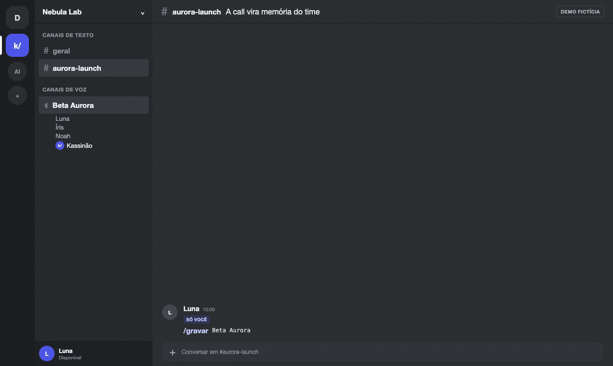

# Kassinão

**Um bot self-hosted de Discord que grava calls e pode transformá-las em memória pesquisável.**

[English](README.md) · [Documentação](https://docs.kassinao.cloud) · [Demo pública](https://kassinao.cloud/demo) · [Conector MCP](mcp/README.md)

[](LICENSE)
[](https://github.com/resolvicomai/kassinao/actions/workflows/ci.yml)

<a href="https://kassinao.cloud/demo"></a>

<sub>Demo fictícia renderizada pela interface do produto. Os recursos de IA estão ligados no exemplo; uma instalação nova começa com eles desligados.</sub>

O Kassinão entra num canal de voz autorizado, publica um painel visível antes de iniciar a captura e mantém uma faixa de áudio separada para cada conta do Discord que fala. Também gera um arquivo mixado e aceita notas com timestamp. Ao terminar a call, pessoas autorizadas usam o app privado para ouvir ou baixar o resultado.

Transcrição, ata por IA, `/perguntar`, webhook e MCP são opt-ins separados, controlados pelo operador. O Kassinão não oferece workspace hospedado, cadastro público nem acervo central de reuniões.

Kassinão é um projeto independente, sem afiliação ou endosso do Discord.

## O que está incluído

**Gravação base, sem provider de IA**

- uma faixa por conta do Discord que fala, além da gravação mixada;
- presença, metadados da reunião e notas com timestamp;
- painel de gravação no chat do canal de voz antes da captura;
- página privada com player e downloads depois que a gravação termina;
- retenção e controle de acesso por reunião.

**Recursos opcionais**

- speech-to-text por provider de ASR configurado ou imagem local criada pelo operador;
- ata, decisões e tarefas por IA depois que existe uma transcrição;
- `/perguntar` sobre reuniões autorizadas, com links para as fontes usadas;
- webhook HTTPS assinado da ata;
- cinco tools MCP read-only expostas pela instância.

A fala é associada à conta/stream do Discord, não identificada depois a partir de uma gravação mixada por diarização. Isso preserva a atribuição da plataforma, mas não prova a identidade real de uma pessoa nem garante que uma faixa parcial ou com falha esteja completa.

## O fluxo real

1. Uma pessoa roda `/gravar` (`/record` em clientes configurados em inglês) num canal de voz.
2. O bot verifica guild, canal, pessoa e permissões obrigatórias.
3. Ele tenta adicionar um indicador ao próprio apelido e publica o painel de gravação. O apelido é best effort; o painel é obrigatório.
4. Cada conta que fala recebe sua faixa. Durante a call, participantes podem criar notas com timestamp.
5. `/parar` encerra a gravação e libera o áudio.
6. Se o operador habilitou ASR e ata, esses jobs rodam de forma assíncrona. O tempo depende da duração, fila, provider, retries e rate limits; não existe SLA fixo.
7. O canal recebe apenas um aviso genérico. Pessoas autorizadas abrem os detalhes no app privado ou por um link enviado em DM autorizada.

O painel é um aviso técnico, não prova de consentimento. O operador responde pelos avisos, permissões, base legal e regras internas exigidos onde o bot é usado, principalmente antes de ativar auto-record.

## Projeto público, instância privada

| Material público do projeto | Material privado do operador |
| --- | --- |
| Fonte AGPL, documentação genérica, Dockerfile, workflows, templates e demo fictícia | Credenciais do Discord/providers, IDs de guild/dono, domínios, rotas do túnel, gravações, estado de autenticação, tokens MCP, backups, escolhas de retenção, paths do host, identificadores de storage e runbooks operacionais |

Cada operador cria um aplicativo separado no Discord e escolhe as próprias URLs e storage. Um deploy novo não deve reutilizar `.env`, volume de autenticação, aplicativo Discord, callback OAuth, token de túnel ou configuração MCP de outra instância.

A AGPL se aplica ao software. Quando um operador modifica o programa e permite interação pela rede, a seção 13 da AGPL em geral exige oferecer a esses usuários o Código-Fonte Correspondente da versão em execução. Configuração de runtime, segredos, gravações e dados da organização continuam privados; mudanças de produto não podem ser escondidas sob o nome de configuração. Defina `SOURCE_URL` para o código realmente oferecido pela versão em execução. Este é um resumo prático, não aconselhamento jurídico; [a licença prevalece](LICENSE).

## Quickstart pelo código-fonte

Este caminho serve para avaliação local e desenvolvimento. Ele compila a imagem a partir do checkout; não é o caminho endurecido de produção.

Requisitos: Docker com Compose e um aplicativo Discord criado por você.

```bash
git clone https://github.com/resolvicomai/kassinao.git
cd kassinao
cp .env.example .env
chmod 600 .env
mkdir -p data/{recordings,state,auth,cache}
chmod 700 data data/*
```

Preencha pelo menos estes valores no `.env`:

```env
DISCORD_TOKEN=seu_token_do_bot
APPLICATION_ID=id_do_seu_aplicativo
DISCORD_CLIENT_SECRET=seu_client_secret_oauth
APP_URL=http://localhost:8080
ALLOW_LOCAL_APP_URL=true
OPERATOR_NAME="Operador local do Kassinão"
PRIVACY_POLICY_URL="http://localhost:8080/privacy"
OPERATOR_CONTACT_URL="http://localhost:8080/privacy#contact"
DATA_DELETION_URL="http://localhost:8080/privacy#data-rights"
PRIVACY_EFFECTIVE_DATE=2026-07-14
PRIVACY_POLICY_VERSION=local-1
PRIVACY_AUDIENCE="Operador usando dados fictícios de teste no localhost"
PRIVACY_PURPOSES="Avaliação local sem dados reais de reunião"
PRIVACY_LAWFUL_BASIS="Avaliação local somente com dados fictícios"
INFRASTRUCTURE_PROVIDER="Máquina local"
INFRASTRUCTURE_REGION="Dispositivo local"
EDGE_PROVIDER=none
EDGE_REGION=none
OPERATIONAL_LOG_RETENTION="Até a remoção deste teste local"
BACKUP_STATUS=disabled
BACKUP_PROVIDER=none
BACKUP_REGION=none
BACKUP_RETENTION_DAYS=0
DATA_REQUEST_PROCESS="Remover os dados fictícios de teste desta máquina local"
DATA_REQUEST_RESPONSE_DAYS=30
INCIDENT_CONTACT_URL="http://localhost:8080/privacy#contact"
INCIDENT_PROCESS="Parar a instância local e remover credenciais e dados de teste"
SOURCE_URL=https://github.com/resolvicomai/kassinao
ALLOWED_GUILD_IDS=id_da_sua_guild_de_teste
ALLOW_ALL_GUILDS=false
KASSINAO_IMAGE=kassinao-local:dev
KASSINAO_PULL_POLICY=never
```

Compile localmente antes de subir o Compose:

```bash
docker build -t kassinao-local:dev .
docker compose up -d --no-build
docker compose logs -f kassinao
```

Num deploy público, use origens HTTPS próprias e mantenha `ALLOW_LOCAL_APP_URL=false`.

## Configurar o aplicativo no Discord

Crie uma aplicação no [Discord Developer Portal](https://discord.com/developers/applications). Cada instância precisa de uma aplicação própria.

1. Copie o **Application ID**, crie o token do bot e copie o **Client Secret** OAuth.
2. Numa instância empresarial privada, desligue **Public Bot** (`bot_public=false`). Isso impede que outras pessoas além do dono da aplicação adicionem o bot a guilds; a allowlist do runtime continua obrigatória.
3. Em **Installation**, use **Guild Install** com os scopes `bot` e `applications.commands`.
4. Peça o bitfield de permissões `68242432`: Ver Canal, Enviar Mensagens, Inserir Links, Ler Histórico de Mensagens, Conectar e Alterar Apelido. Alterar Apelido é recomendada; as outras cinco são obrigatórias no canal gravado.
5. Em **OAuth2 → Redirects**, cadastre exatamente `${APP_URL}/auth/callback`.
6. Em **General Information → Privacy Policy URL**, cadastre `${APP_URL}/privacy`. A página precisa ser publicamente acessível e descrever o deploy real desse operador.
7. O login web pede apenas o scope OAuth `identify`. O vínculo com uma guild permitida é conferido separadamente pelo bot.

Modelo da URL de instalação:

```text
https://discord.com/oauth2/authorize?client_id=SEU_APPLICATION_ID&scope=bot%20applications.commands&permissions=68242432
```

O bot não solicita Gateway intents privilegiados. Ele inspeciona somente o necessário do conteúdo de DMs para detectar uma tentativa de slash command e devolver uma orientação de uso.

## Modelo de acesso

A URL da instância é informação pública, não uma barreira de segurança. Web e MCP exigem:

- login com Discord;
- vínculo atual com uma guild da allowlist; e
- ACL da reunião: quem iniciou, quem foi gravado/esteve naquela call ou uma pessoa atual com Gerenciar Servidor.

Sair da guild remove o acesso. Ganhar permissão de canal depois não abre reuniões antigas. Se o Discord não consegue confirmar o vínculo com segurança, o acesso falha fechado ou retorna indisponibilidade temporária em vez de liberar dados. `OWNER_IDS` não ignora a ACL das reuniões.

## Deploy de produção

O repositório contém um workflow de release e ferramentas para gerar um kit operacional destinado a uma produção separada, sem checkout Git nem código-fonte da aplicação na VPS. O próprio kit contém controles operacionais públicos selados em Shell/Python, templates sem segredos e runtimes nativos de no-dump. A presença desses arquivos numa branch não prova que uma release, imagem GHCR, kit, checksum ou attestation já está pública.

Use o caminho endurecido somente depois que a release escolhida puder ser verificada publicamente:

- a GitHub Release e os assets do kit existem e estão imutáveis;
- a imagem OCI exata resolve por digest `sha256` no GHCR;
- checksum, política de tag/source, integridade da release e attestations do GitHub passam;
- uma instalação limpa a partir desse kit público passou nos gates da release.

Se algum artefato não existir, use o build por source apenas para avaliação local e aguarde uma release verificável. Não substitua um digest ausente por tag mutável e não compile o produto na VPS de produção.

A topologia endurecida pretendida é **somente split**. Landing/docs/demo rodam num processo público sem segredos; bot/app privado/MCP rodam no core privado, com hosts e allowlists próprios. Os dois adapters de produção exigem uma VPS Linux amd64 ou arm64 com systemd 249+, Docker Engine 28.0.0+, Docker Compose 2.35.0+, GNU coreutils, iptables/ip6tables, iproute2, util-linux, cryptsetup, e2fsprogs, curl, Python 3, tar/gzip e storage dm-crypt/LUKS. Confira arquitetura e versões antes de criar ou montar storage; o bundle nativo, deploy e audit falham fechados em hosts incompatíveis.

Escolha exatamente um adapter de host:

O modo shared tem um pré-requisito privado e global do host antes de qualquer gate público: avalie todos os workloads vizinhos e use o runbook privado da instância para aplicar e persistir exatamente `kernel.core_pattern=/dev/null` e `fs.suid_dumpable=0`. Registre os valores anteriores, o impacto global e o procedimento de recuperação. O kit público verifica, mas nunca muda essas configurações. Só depois dessa verificação privada deve rodar `audit-shared-vps-security.sh --neighbors-only`.

- **Dedicado (padrão):** defina `KASSINAO_HOST_SCOPE=dedicated` e confirme explicitamente `KASSINAO_DEDICATED_DOCKER_HOST_ACK=I_UNDERSTAND_THIS_VPS_MUST_RUN_ONLY_KASSINAO`. Este caminho exige que a VPS e o daemon Docker rodem apenas Kassinão, porque seus controles `ExecStartPre` afetam o `docker.service` inteiro; o audit reprova containers alheios. Monte a raiz de dados configurada em dm-crypt/LUKS e use `prepare-storage.sh`, `install-host-controls.sh`, `deploy-release.sh` e `audit-vps-security.sh` do kit verificado.
- **Host compartilhado confiável:** defina `KASSINAO_HOST_SCOPE=shared` e mantenha `KASSINAO_DEDICATED_DOCKER_HOST_ACK` vazio. Este caminho serve para outros workloads controlados pelo mesmo operador confiável, não para tenants hostis ou sem confiança mútua. Ele adiciona `docker-compose.shared.yml`, mantém cada container do Kassinão com `MemorySwap=Memory`, swappiness `0` e restart policy `no`, e não instala drop-in no serviço Docker nem reinicia o daemon Docker global. Antes de abrir ou montar storage, execute `audit-shared-vps-security.sh --neighbors-only`. Uma instalação nova monta um file-container LUKS2 em `KASSINAO_DATA_ROOT` e executa `prepare-shared-storage.sh`; o script inicializa `config/app.env` cifrado com defaults públicos seguros e cria o lock de manutenção exigido pelo injector. Uma instalação plaintext legada sem `KASSINAO_HOST_SCOPE` precisa primeiro passar em `validate-legacy-dedicated-installation.sh`; o watchdog antigo exato só é removido após byte-match, e os containers parados continuam presentes enquanto `prepare-legacy-shared-layout.sh` prova e consolida os mounts de recordings/cache. O helper registra apenas path, identidade filesystem, metadados e hash do `.env` legado e move esse controle privado para um diretório root-only diretamente sob `DATA_ROOT`, fora de todos os binds graváveis pelo runtime; nenhum manifesto de origem permanece na release plaintext após o preparo. Só depois esses containers são removidos e `migrate-shared-storage.sh` roda com o mapper novo aberto e desmontado. A migração importa somente chaves operacionais presentes no template público; host, Compose, token do túnel e valores desconhecidos nunca entram no app.env cifrado. Preparo, migração e injeção repetem o gate dos vizinhos antes de escritas protegidas. Continue com `install-shared-host-controls.sh`, `deploy-release.sh` e o audit completo. O audit shared reserva projeto, nomes, bridges, redes, mounts e allowlists de ambiente do Kassinão e reprova workloads vizinhos com acesso privilegiado, device, Docker, namespace, capability, storage protegido, source legado ou rede do Kassinão.

O adapter shared limita a interação do Kassinão com workloads vizinhos; ele não protege a instância contra o usuário root do host, administradores do Docker ou o operador da infraestrutura/hypervisor. Use o adapter dedicado quando essas partes não forem todas confiáveis.

No layout legado v1.4.9, arquivos de metadados na raiz de `recordings/` ficam restritos a sete nomes conhecidos. O preparo mantém seus paths co-located tanto na origem quanto no rollback plaintext. Somente o staging cifrado da migração os distribui em `state/` e `auth/`, grava o marker exato `state/.layout-v2` e deixa `auth/.instance-id` para o primeiro boot do runtime novo. Arquivo root desconhecido ou conflito com mount explícito de state/auth falha fechado.

A ordem do cutover v1.4.9 é rígida: aplique a política global privada do host antes do primeiro helper público; valide o projeto legado vivo; remova o health-watch exato; pare, mas mantenha seus containers; prepare o layout plaintext consolidado; e só então rode o Compose down. Depois que os containers estiverem ausentes, `remove-legacy-dedicated-host-controls.sh` prova o marker v3 preparado, `.env` original, bundle legado, arquivos instalados restantes, hooks efetivos do systemd, policy de firewall, PID do Docker e snapshot dos containers vizinhos antes de remover somente a allowlist dedicated. Um conjunto totalmente ausente é no-op seguro; qualquer conjunto parcial, alheio ou desviado falha antes de mutar. O helper nunca reinicia o Docker, altera containers, apaga nenhuma raiz de dados, remove a release ou `.env` antiga, nem remove o lock de manutenção.

No shared, os seis limites explícitos `KASSINAO_{CORE,PUBLIC,TUNNEL}_{MEMORY_LIMIT,CPUS}` precisam deixar ao menos 25% da RAM física e das CPUs online para os workloads vizinhos. O audit compara `compose.env`, overlay, capacidade real e runtime Docker. Como o device de storage varia, o adapter não inventa um throttle de I/O: monitore latência e throughput e dimensione as janelas de processamento e backup.

O modo shared também exige `KASSINAO_UID` e `KASSINAO_GID` explícitos na faixa privada `61000..61183`. Escolha um par livre somente depois de conferir contas/grupos do host, faixas de IDs subordinados, processos, arquivos protegidos, `Config.User` dos containers vizinhos e árvores anteriores do Kassinão. Não crie usuário nem grupo Linux para esse par. Os exemplos públicos deixam os dois valores vazios, e preparo/auditoria falham fechado em colisões. Instalações dedicated e local podem manter o default documentado `1000:1000`.

As regras abaixo valem para os dois adapters:

- o footprint de produção do Kassinão guarda apenas kit verificado root-owned, arquivos privados de ambiente e volumes de dados, sem checkout Git, compilador ou credencial do GitHub do Kassinão. No host dedicado isso vale para a VPS; no compartilhado, para os paths e processos reservados do Kassinão, sem fazer afirmações sobre workloads vizinhos confiáveis;
- a imagem da release fica presa por digest;
- dados ativos, estado de autenticação, cache e snapshots de deploy permanecem dentro da barreira dm-crypt/LUKS comprovada pelo adapter;
- no adapter shared, os segredos do app e o token do túnel também ficam nessa barreira e chegam somente ao container não-root correspondente por bind mount read-only;
- depois de montar e proteger a barreira de storage, o script de preparo correspondente a comprova antes de criar somente os quatro diretórios de runtime como `0700` no UID/GID não-root configurado;
- um deploy concluído apaga imediatamente o próprio snapshot de rollback. Um deploy que falha pode manter estado operacional e metadados de gravações, sem auth nem faixas de áudio, pela janela `KASSINAO_ROLLBACK_RETENTION_HOURS` (72 horas por padrão, máximo de 168), aplicada por um timer persistente do host;
- firewall, SSH, egress escopado, modos de arquivos, backup e testes externos dos hosts precisam passar antes de publicar a instância.

Não existe tamanho universal para o storage shared. O dimensionamento precisa incluir gravações retidas, duração e concorrência máximas, faixas temporárias do processamento, cache, crescimento e margem de recuperação, preservando uma reserva explícita para cada workload vizinho. O backing LUKS é pré-alocado e não cresce sozinho. Revise `MIN_FREE_MB_START`, `MIN_FREE_MB_ABORT` e `DISK_ALERT_PCT` para a capacidade escolhida, monitore o filesystem cifrado e o filesystem do host e use o procedimento offline de expansão antes de qualquer uma das duas fronteiras ficar apertada.

As quatro origens HTTPS configuradas precisam resolver antes de `deploy-release.sh`, porque o gate final testa cada superfície por fora. Elas usam três ou quatro hostnames: `MCP_URL` pode ser igual a `APP_URL`, mas landing e docs continuam separados do core privado. Mantenha o bot sem invite distribuído e a instância sem anúncio até deploy e audit passarem.

`APP_URL`, `MCP_URL`, `PUBLIC_URL` e `DOCS_URL` continuam sendo as origens HTTPS externas. Nas regras de ingress do túnel do Compose, roteie os hostnames de app/MCP para `http://kassinao:8080` e os de landing/docs para `http://kassinao-public:8081`. Um proxy no host usa as portas loopback correspondentes de `KASSINAO_HOST_PORT` e `KASSINAO_PUBLIC_HOST_PORT`. Nunca exponha nenhuma das duas portas diretamente à internet.

O deploy, a migração plaintext legada, o reboot, a expansão de storage e a remoção segura dos controles do host ficam na [documentação](https://docs.kassinao.cloud). Converter um adapter moderno dedicated/shared exige um procedimento auditado separado, porque seu `DATA_ROOT` já está montado; nunca rode nele o migrador plaintext. `uninstall-host-controls.sh` e `uninstall-shared-host-controls.sh` recusam containers em execução/com restart, snapshots pendentes e drift; nenhum deles para containers, reinicia o Docker ou apaga release, storage, backing file ou segredos. A migração legada shared preserva `DATA_ROOT.plaintext-before-shared-luks` e grava um marker cifrado `pending` com prazo de 1 a 168 horas. Enquanto ele existir, o checker bloqueia estados incoerentes; depois do prazo, deploy, backup, health e audit falham fechados. Após validar app, acesso, uma gravação real e um backup restaurável, pare somente o Kassinão, expurgue primeiro os sources legados com `prepare-legacy-shared-layout.sh --purge-originals` e só então execute `finalize-shared-migration.sh --confirm-destroy-plaintext-rollback`. O purge confirmado revalida bytes e identidade exatos do `.env` legado antes de remover somente esse arquivo; nenhum outro arquivo da release antiga é apagado. Isso é exclusão lógica: backups do provedor, snapshots e remanência de storage ainda podem conter segredos antigos, então rotacione todas as credenciais migradas de Discord, providers, MCP, túnel e sessões após a validação. Após reboot, mantenha o Kassinão parado até um operador digitar a passphrase LUKS diretamente no prompt do `cryptsetup`, provar o storage e rodar deploy e audit escopados; nunca guarde material de unlock na VPS, em env, cloud-init ou unit systemd. Segredos, paths do host, valores de backing/mapper/UUID do LUKS, material de unlock, evidências operacionais e a política específica da organização ficam fora deste repositório.

## Privacidade e fluxo de dados

Uma instalação nova começa gravando áudio e com egress externo de IA desligado:

- `TRANSCRIBE_PROVIDER=none`
- `TRANSCRIBE_FALLBACK_PROVIDER=none`
- `MINUTES_ENABLED=false`
- MCP desligado até definir `MCP_SECRET`
- retenção de áudio: 7 dias
- retenção de texto/metadados: 90 dias

Ativar ASR em nuvem, ata por IA, webhook, backup remoto ou MCP envia os dados necessários àquele recurso para o destino configurado pelo operador. “Self-hosted” não significa que os dados nunca possam sair do servidor.

[`PRIVACY.md`](PRIVACY.md) explica o que o projeto público faz e traz um checklist para operadores. Ela não substitui a política do deploy. Produção exige que o operador publique identidade/contato, política e fluxo de exclusão reais e exponha essas informações em `APP_URL/privacy`.

Controles de segurança e responsabilidades estão em [`SECURITY.md`](SECURITY.md). Nunca coloque credenciais, URLs privadas, identificadores, logs com conteúdo de reunião, gravações, `.env`, estado de autenticação ou pedidos de dados numa issue pública.

## Conector MCP

Quando o operador habilita o recurso, o [`kassinao-mcp`](mcp/README.md) roda localmente como cliente stdio e solicita dados autorizados dessa instância por HTTPS. Ele exige seu próprio `KASSINAO_URL`; não existe API compartilhada hospedada nem fallback para o upstream. As cinco tools desta versão são read-only, não servem áudio e obedecem às mesmas verificações de vínculo atual e ACL do app web.

## Comandos

Os comandos usam nomes em pt-BR por padrão e localizações em inglês no Discord.

| pt-BR | Inglês | Disponibilidade |
| --- | --- | --- |
| `/gravar`, `/parar`, `/nota`, `/status` | `/record`, `/stop`, `/note`, `/status` | Gravação base |
| `/gravacoes`, `/ajuda`, `/sobre` | `/recordings`, `/help`, `/about` | App/ajuda base |
| `/privacidade` | `/privacy` | Política da instância e contato do operador |
| `/autorecord`, `/config` | mesmos nomes/opções localizadas | Gerenciar Servidor quando exigido |
| `/perguntar` | `/ask` | Só quando o recurso de ata/LLM está habilitado |
| `/mcp` | `/mcp` | Só quando MCP está habilitado; oculto por Gerenciar Servidor e validado por `OWNER_IDS` |

Participantes criam e revogam as próprias conexões MCP pelo app privado quando esse recurso está habilitado.

## Desenvolvimento

Node.js 22+ é obrigatório.

```bash
npm ci --userconfig .npmrc.security
cp .env.example .env
npm run dev
```

Antes de abrir um PR:

```bash
npm run lint
npm run build
npm run typecheck:preview
npm test
npm run format:check
```

Veja [`CONTRIBUTING.md`](CONTRIBUTING.md), [`SECURITY.md`](SECURITY.md) e o [relatório de pesquisa por trás dos claims do produto](docs/research/2026-07-14-product-truth.md).

## Licença e custos

Kassinão usa a licença [AGPL-3.0-or-later](LICENSE). O software não cobra licença, mas cada operador paga e administra a própria infraestrutura, storage, domínio, backups e providers externos que habilitar.
